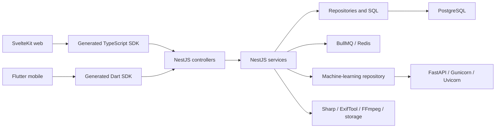

# Current architecture overview

## Verified shape

Lamha begins from an unpacked Immich monorepo snapshot. The live browser client is SvelteKit/Svelte; it calls the generated TypeScript SDK over HTTP/WebSocket paths. NestJS controllers delegate to services, repositories, Kysely/PostgreSQL queries, BullMQ/Redis workers, storage/media tools, and the Python FastAPI machine-learning service. Flutter mobile, generated SDKs, Docker/deployment, docs, CI, and e2e suites are additional consumers or lifecycle blockers.

## Corpus areas

| Curated area | Files |
|---|---|
| API_SOURCE | 11 |
| ASSET | 180 |
| CI_CD | 33 |
| DEPLOYMENT | 37 |
| DOCUMENTATION | 331 |
| FRONTEND | 654 |
| GENERATED | 444 |
| I18N | 79 |
| LEGAL | 6 |
| MACHINE_LEARNING | 46 |
| MOBILE | 928 |
| OS_METADATA | 1 |
| PACKAGE | 45 |
| PROJECT_SUPPORT | 6 |
| ROOT_CONFIG | 16 |
| SERVER | 459 |
| TEST | 421 |

## Phase 1 interpretation

- Current feature UI is reusable only where it can be detached from server SDK/auth assumptions.
- Server, PostgreSQL, Redis, HTTP/WebSocket, Docker, mobile backup, sharing, and administration remain dependency evidence until each retained caller has a local replacement.
- There is no current Rust/Tauri tree. Target desktop modules are therefore planned nodes, never misreported as existing code.
- Raw AST evidence remains in `graphify-out/graph.raw.json`; the canonical directed graph adds every corpus file, requirement, feature, test, target, and removal relationship.
