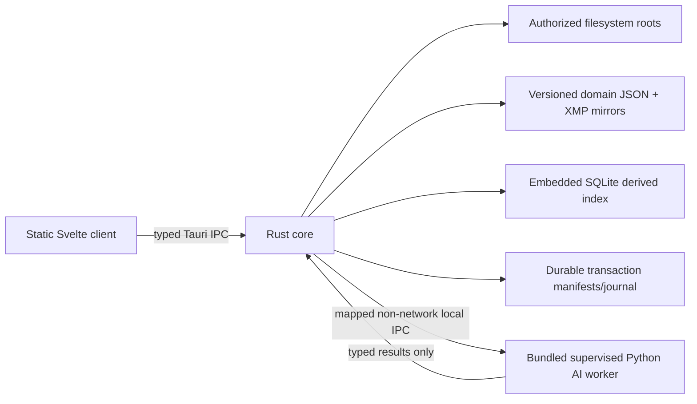

# Target desktop architecture

## Selected Phase 1 structure

- One desktop application; no required Node/SvelteKit server runtime.
- Svelte has no filesystem, database, or AI-worker authority and reaches local capabilities only through typed Tauri commands.
- Rust owns path authorization, domain validation, sidecar/XMP writes, transaction durability, index coordination, review decisions, and worker supervision.
- The worker has no authoritative write access, listening port, HTTP/WebSocket service, media/private-metadata upload, cloud dependency, or unrelated-client access.
- Phase 1 recommends length-prefixed child standard input/output and records named pipes, Unix-domain sockets, and Tauri sidecar-managed communication as evaluated alternatives; the evidence and mechanism-specific risks remain in `LOCAL_AI_WORKER_MAP.md`.
- Filesystem/domain JSON are durable authority by domain; SQLite is a rebuildable index/working-state store.
- Exact target names selected below are Phase 1 decisions and may change only through a traced migration/decision update.
