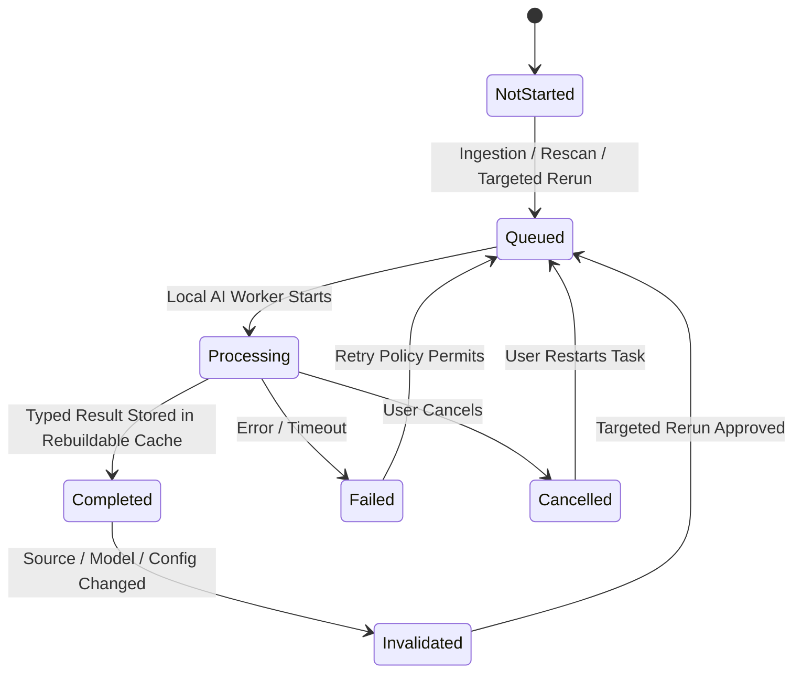
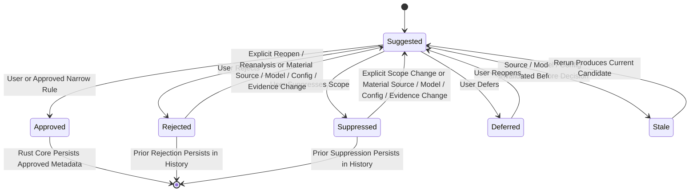
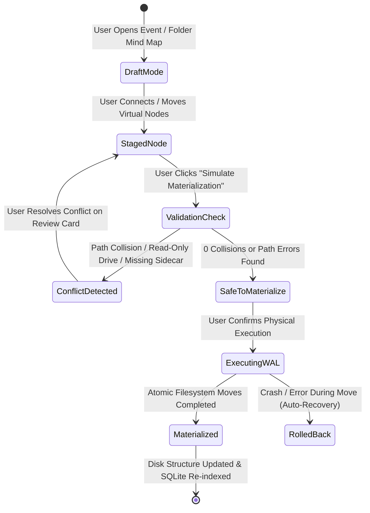
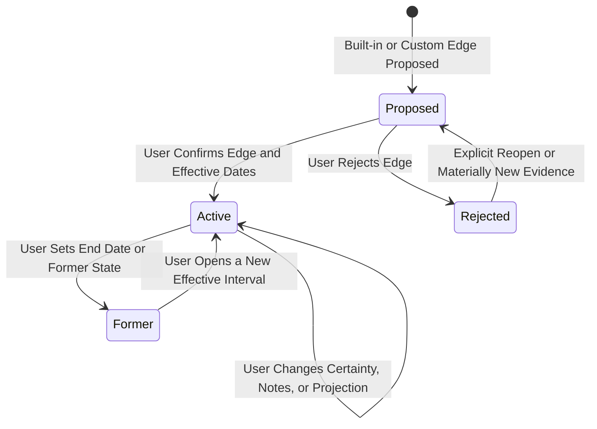

# LAMHA — EVERYTHING WE ARE KEEPING

## Authoritative Master Plan File 1 of 3

**Application name:** Lamha  
**Document role:** Complete definition of the approved Immich-derived behaviours and new Lamha capabilities that must exist in the finished application  
**Authority:** This file is authoritative together with:

1. `02-EVERYTHING-WE-ARE-DELETING.md`
2. `03-HOW-WE-WILL-KEEP-DELETE-AND-CHANGE.md`

Graphify must map every item in this file to the current codebase or explicitly record that the capability does not yet exist and must be created.

### Reading contract

- `MUST`, `MUST NOT`, `REQUIRED`, and invariant-table entries are binding.
- `SHOULD` is binding unless Graphify records a concrete technical blocker and an approved alternative.
- `MAY` and “optional” describe permitted behaviour, not a completion requirement.
- Examples illustrate a rule; they do not narrow or expand it.
- A named implementation, command, table, path, model, or library is a target constraint only when this file explicitly calls it canonical. Otherwise Graphify must verify the real repository before assigning an exact implementation.
- File 1 owns retained final behaviour, File 2 owns final absences, and File 3 owns process, sequencing, evidence, and status. No file may be read in isolation.

---

# 1. Final Product Identity

Lamha is a private, single-user, local-first photo and video management application for:

- Windows
- macOS
- Linux
- Internal drives
- External drives
- Portable local libraries
- Completely offline use

Lamha is derived from the useful interface and media-management capabilities of Immich, but it is not a self-hosted server product.

Lamha keeps the parts of Immich that make it a capable gallery and media intelligence application, while converting them into a genuine local desktop architecture.

The final application must feel like one integrated desktop application. The user must not need to understand Docker, servers, databases, network ports, or system administration.

> [!IMPORTANT]
> **Disambiguation Box 1: Current Architecture vs. Target Architecture**
> - **Current Architecture (To Be Removed)**: Immich-derived client-server model relying on standalone REST/WebSocket backend processes, PostgreSQL databases, Redis job queues, Docker/container deployment, multi-user account authentication, and remote network access.
> - **Target Architecture (To Be Implemented)**: A unified, single-user, local-first desktop application built on a **Tauri 2** shell, **Svelte/SvelteKit** UI, **Rust** desktop core, **SQLite** local rebuildable index, bundled local AI worker communicating exclusively via local IPC, and transparent JSON/XMP file sidecars.
> - **Execution Guardrail**: A weaker coding model MUST NEVER implement server REST endpoints in Rust, embed PostgreSQL/Redis in Tauri, or require network ports for core application logic.

> [!WARNING]
> **Anti-Prototype & Anti-Stub Guardrail**
> It is strictly illegal to write stub functions (`// TODO: implement later`), mock implementations, static dummy JSON returns, or comment out failing tests to achieve completion. Every retained feature must be fully functional, backed by real file-system sidecars and SQLite indexes, and capable of handling production error states.

---

# 1.1 Canonical Glossary of Core Entities & Managed Capabilities

To prevent lower-capability coding models from guessing or misinterpreting terminology, the following definitions are canonical, binding, and authoritative across the entire Lamha codebase and specification:

1. **Managed Asset (`LAM-ASSET-001`)**: A photo or video file located inside an approved Library Root whose metadata, relationships, and AI processing state are actively tracked by Lamha via co-located sidecars and embedded SQLite indexing.
2. **Indivisible Bundle (`LAM-ASSET-002`)**: The canonical steady-state storage unit consisting of `media.ext` (primary media), `media.ext.asset.json` (authoritative Lamha asset sidecar), and `media.ext.xmp` (interoperability mirror). Lamha-authored organization operations treat the three paths as one transaction. Missing/detached sidecars, read-only overlays, cross-drive staging, Trash, backups, and exports are explicitly defined degraded or temporary states, not additional authoritative media copies.
3. **Primary Media Container**: A supported image (`.jpg`/`.jpeg`, `.png`, `.heic`/`.heif`, `.webp`, `.gif`, supported RAW including `.dng`) or video (`.mp4`, `.mov`, `.mkv`) file representing a capture. Lamha never modifies it during normal organization, tagging, or non-destructive editing.
4. **Co-located Sidecar**: A metadata file stored in the exact same physical directory as its primary media container, sharing the exact same base filename with an added extension (`.asset.json` or `.xmp`).
5. **Authoritative Metadata**: Versioned transparent JSON stored in the correct domain record: `.asset.json` for asset facts, the canonical `event.json` for event facts, `person.json` for person facts, `group.json` for group facts, `relationship.json` for relationship edges, and map/tag/album/operation JSON for their own domains. XMP and SQLite never silently outrank these records.
6. **Derived Index**: Lamha uses a local embedded SQLite index and working-state store in its OS application-data area. It is rebuildable and is never the only authoritative copy of saved user decisions, durable history, approved metadata, suppression decisions, or unresolved pending overlays. The exact database filename and internal schema are resolved during Phase 1 target-schema mapping and implemented in the assigned phase.
7. **Event Folder (`LAM-FOLDER-001`)**: A physical directory created by Lamha inside an approved writable Library Root, structured as `Year/YYYY-MM-DD_Event-Name/` or, when no date is approved, `Unknown Date/Unknown-Date_Event-Name/`. A dated folder uses the user-approved event start date; capture timestamps may initialize a proposal but never override the user.
8. **Linked Folder (`LAM-FOLDER-002`)**: An existing user directory indexed in place via non-destructive reference. Assets in linked folders are never moved or renamed by Lamha unless explicitly commanded by the user.
9. **Virtual Smart View (`LAM-UI-002`)**: A dynamic, non-physical gallery view generated at runtime by querying SQLite for specific criteria (e.g., People, Groups, Tags, Favorites, Memories). No physical directories are ever created on disk for virtual views.
10. **Relationship Composition View (`LAM-REL-001`)**: A specialized virtual gallery tab that derives the nine approved composition views from effective-dated relationship edges and three composition buckets: Family, Friends, and Family Friends. These buckets are projections, not a stored closed person enum.
11. **Person Profile (`LAM-PERSON-001`)**: A persistent identity entity bearing a stable UUID, canonical name, historical membership timeline, and optional aliases, linking face clusters across the library.
12. **Face Cluster (`LAM-FACE-001`)**: A model-versioned grouping of face embeddings whose dimension is declared by the selected local model, never hard-coded by the application. Rebuildable embeddings remain in the AI cache; approved face regions and Person Profile links are stored in `.asset.json` using normalized bounding boxes.
13. **Group Profile (`LAM-GROUP-001`)**: A named social entity comprising two or more Person Profiles, supporting recursive parent-group nesting and temporal membership intervals with joined and left dates. Exact serialized key names are selected during target-schema mapping.
14. **Temporal Membership Interval**: An explicit start and end date defining when a person belonged to a group (e.g., college roommate years), ensuring historical photos retain accurate contextual grouping.
15. **Local AI Worker (`LAM-AI-001`)**: A bundled local child process executing machine-learning inference. The desktop application launches and supervises it; it exposes no HTTP, WebSocket, TCP, or UDP listener, uploads no media or private metadata, requires no cloud service, and remains unavailable to unrelated external clients. Phase 1 selects the non-network local IPC mechanism after mapping the existing transport, lifecycle, streaming, cancellation, cross-platform, packaging, and security constraints. Permitted candidates include standard input/output, named pipes, Unix-domain sockets, Tauri sidecar communication, or another validated non-network mechanism.
16. **Suggestion Queue (`LAM-REVIEW-001`)**: A staging area in the rebuildable SQLite working store for unapproved consequential candidates—such as identity, tag, relationship, location, photographer, or duplicate actions—awaiting Review. Rebuildable embeddings, hashes, OCR indexes, and thumbnails are derived cache data rather than approval candidates. Its serialized and database names are selected during target-schema mapping.
17. **Candidate Rejection Record**: A persistent authoritative decision containing the task concept, candidate identity, model identity/version, evidence, scope, and decision time. An equivalent candidate must not automatically return when its source, model, relevant configuration, and material evidence are unchanged. Reconsideration is permitted after an explicit user reopen/reanalysis request or a material source, model, configuration, candidate-identity, or evidence change; the prior decision and provenance remain visible and the new candidate enters Review rather than approval.
18. **Invalidation State**: A required AI-task concept tracking whether a result is current, stale, or requires re-inference because its source, model, or relevant configuration changed. Phase 1 target-schema mapping selects the exact serialized field and values.
19. **Library Root (`LAM-LOCAL-001`)**: An absolute OS filesystem path explicitly authorized by the user for recursive media scanning and managed storage.
20. **Detached Index Mode (`LAM-EXTERNAL-001`)**: An operational state activated when a Library Root is unavailable or read-only. Cached browsing/search remain available; filesystem mutations are disabled; metadata edits are stored as transparent pending overlays until an explicit, conflict-checked flush is possible.
21. **Primary Library Root**: The one writable Library Root selected for a library profile that contains authoritative library-level `.app-data/` JSON records and operation history. If it is unavailable/read-only, browsing continues from cache and metadata edits may become Pending Overlays, but operations requiring global reference/history commits may be planned only and must not execute.
22. **Authorized Path Set**: Library Roots, Lamha-owned OS application-data/cache paths, Lamha-created root-scoped backup/Trash/staging paths, and individual import/export destinations explicitly selected by the user. Lamha must not recursively scan or mutate any other path.
23. **Pending Overlay**: A versioned transparent JSON edit record held in Lamha’s OS application-data area when its authoritative destination is unavailable or read-only. It is temporary but durable, visible in Review, conflict-checked before flush, and never silently discarded.
24. **Companion Set (`LAM-ASSET-003`)**: Two or more distinct managed asset bundles linked by stable UUIDs because they form one capture experience, such as a Live Photo still+video or RAW+JPEG pair. Each media container keeps its own UUID and two sidecars; a companion set is never implemented by one sidecar ambiguously owning multiple media files.
25. **Transaction Manifest**: Versioned transparent JSON keyed by an immutable transaction UUID. Before mutation, Lamha fsyncs a coordinator copy in OS application data and a mirror under every affected writable Library Root’s `.app-data/manifests/`; SQLite only indexes it. Commit/recovery reconciles the copies and appends durable operation history.

---

# 1.2 System Invariants Governing Kept Capabilities

The following non-negotiable System Invariants govern all code implementation for Lamha capabilities:

| Invariant ID | Domain | Invariant Title | Mandatory Architectural Rule |
|---|---|---|---|
| **LAM-INV-ASSET-01** | Assets | **Single Media Authority** | Each managed asset corresponds to exactly one authoritative primary media file on disk. Physical duplication of media containers for categorization is strictly prohibited. |
| **LAM-INV-ASSET-02** | Assets | **Stable Asset UUIDs** | Once assigned, an asset's stable UUID is immutable and must never change, even if the file is moved, renamed, or modified. The serialized key name is deferred to target-schema mapping. |
| **LAM-INV-ASSET-03** | Assets | **Mandatory Co-located Sidecars**| Every writable managed asset MUST converge to a co-located `.asset.json` plus `.xmp`. A missing sidecar or pending read-only overlay is a visible degraded state; it is not permission to ignore, delete, or duplicate the asset. |
| **LAM-INV-ASSET-04** | Assets | **Indivisible Bundle Movement** | Every Lamha-authored move, rename, Trash, restore, or permanent delete MUST transact the media and both sidecars as one bundle. Cross-drive operations may create verified temporary copies but have only one committed authoritative location. |
| **LAM-INV-ASSET-05** | Assets | **Original Filename Preservation**| The original filename at the time of ingestion must be permanently stored in the authoritative asset record and never overwritten. The serialized key name is deferred to target-schema mapping. |
| **LAM-INV-ASSET-06** | Assets | **Controlled Copy Exceptions** | Backups, privacy-clean exports, edited derivatives, and in-progress cross-drive staging are permitted only when excluded from categorization scans or assigned a new derivative UUID. They never create a second authoritative location for the same asset UUID. |
| **LAM-INV-ASSET-07** | Assets | **Companion Bundle Independence** | Every container in a Companion Set is a complete independent three-file bundle. Pair-level rename/move/Trash/restore actions coordinate all linked bundles in one higher-level transaction, while a missing companion remains a visible degraded link rather than invalidating the surviving asset. |
| **LAM-INV-EVENT-01** | Events | **Event Directory Naming** | Dated Event Folders created by Lamha follow `Year/YYYY-MM-DD_Event-Name/` using the user-approved start date. An event with no approved date uses `Unknown Date/Unknown-Date_Event-Name/`. Capture timestamps may suggest, but never silently decide, a date. |
| **LAM-INV-EVENT-02** | Events | **Multi-Day Event Unity** | Events spanning across midnight or multiple days must remain a single unified physical directory unless explicitly split by the user. |
| **LAM-INV-EVENT-03** | Events | **Linked Folder Immobility** | Assets inside user-designated Linked Folders MUST never be moved, renamed, or reorganized by automated event builders. |
| **LAM-INV-PERSON-01**| People | **Stable Identity UUIDs** | Person Profiles and Group Profiles MUST be referenced by stable UUIDs across all sidecars and database tables; canonical names are mutable presentation labels. |
| **LAM-INV-PERSON-02**| People | **Multiple Effective-Dated Relationship Edges**| A Person Profile may have multiple simultaneous and historical built-in or custom relationship edges, each with effective dates, active/former state, certainty, notes, and change history. Composition is derived through explicit approved projection rules, never a closed person-category enum. |
| **LAM-INV-PERSON-03**| People | **Historical Membership Immutability**| Removing a person closes the active temporal interval using a user-approved effective end date (default now); past photos MUST continue to reflect historical membership. Rejoining creates a new interval. Exact serialized key names are deferred to target-schema mapping. |
| **LAM-INV-META-01** | Metadata | **Filesystem Path Authority** | The physical OS filesystem is the sole authoritative source of truth for current file location, directory structure, and file naming. |
| **LAM-INV-META-02** | Metadata | **Domain-Scoped JSON Authority**| `.asset.json` owns approved asset metadata; event/person/group/relationship/map/tag/album/operation JSON own their named domains. Cross-domain references use stable UUIDs. No record may silently overwrite another domain’s authority. |
| **LAM-INV-META-03** | Metadata | **SQLite Derived Cache Status** | The local embedded SQLite index and working-state store is non-authoritative for persisted user decisions. Deleting it and all rebuildable caches MUST permit recovery from filesystem state and transparent authoritative JSON; only unsaved transient work may be lost. Its filename and internal schema are not locked by this plan. |
| **LAM-INV-META-04** | Metadata | **Pending Overlay Exception** | A Pending Overlay is the only sanctioned temporary authority when its normal JSON destination is unavailable/read-only. It must be durable, reviewable, backed up, and reconciled before being removed. |
| **LAM-INV-AI-01** | AI Workers | **Zero AI Autonomous Authority** | ML workers have zero write authority over authoritative JSON. They may write only typed results to the Rust core, which stores rebuildable outputs in caches/queues. Only an explicit user action or an already-approved narrow rule may cause the Rust core to persist approved metadata. |
| **LAM-INV-AI-02** | AI Workers | **Persistent Rejection with Controlled Reconsideration** | Rejecting or suppressing a candidate MUST persist its candidate/task/model provenance and scope. Score drift or a routine rerun must not bypass the decision. A materially changed source, model/version, relevant configuration, candidate identity, or evidence—or an explicit user reopen/reanalysis request—may create a new Review candidate while preserving the prior decision in history. |
| **LAM-INV-AI-03** | AI Workers | **Hardware Assessment** | AI batch processing MUST run hardware checks (CPU, RAM, GPU) and display estimated completion times for user confirmation before starting heavy ML jobs. |
| **LAM-INV-AI-04** | AI Workers | **Task Invalidation Tracking** | AI state MUST track task status, model identity, model version, source identity or hash, relevant configuration identity or hash, processing time, and invalidation/staleness state. Phase 1 target-schema mapping selects exact serialized names and values. |
| **LAM-INV-FS-01** | Storage | **Authorized-Path Sandboxing** | Recursive media scanning is limited to Library Roots. Writes are limited to the Authorized Path Set, and every one-off import/export destination must be explicitly selected and scoped to that operation. |
| **LAM-INV-COMP-01** | Execution | **Autonomous Codex Execution** | Autonomous coding models MUST fully implement and verify assigned requirements without requesting manual user code completion or TODO stubs. |
| **LAM-INV-COMP-02** | Execution | **Anti-Guessing & Anti-Stub** | Unmapped legacy paths or ambiguous options MUST be logged in `05-keep-port-rewrite-remove/BLOCKED_OR_UNKNOWN.md` as `DEFERRED — REQUIRES PRODUCT DECISION`. Stubs/mocks are strictly illegal. |
| **LAM-INV-COMP-03** | Execution | **Replacement-Before-Removal Guardrail** | A legacy subsystem may be removed in its assigned safe phase only after every file/symbol/caller/consumer/route/import/test/generated binding/build/config/runtime dependency is mapped, retained behaviour has a working local replacement, callers are migrated, focused/regression/build/desktop-launch proof passes, Graphify and Ponytail evidence agree it is no longer load-bearing, and rollback/baseline plus removal proof exist. Phase 16 removes residual obsolete material and performs final release verification; it is not an artificial delay for already safe removals. |

---

# 1.3 Directional Source-of-Truth & Authority Matrix

To prevent metadata sync loops and conflicts between JSON sidecars, XMP files, embedded EXIF, and SQLite, the following directional authority matrix is binding:

| Metadata concept | Authoritative Source of Truth | Mirror / Interoperability Target | Derived Read Cache | Directional Sync Rule & Conflict Behavior |
|---|---|---|---|---|
| Filesystem path and filename | **OS Filesystem** | Asset JSON current-location concept | SQLite index | Filesystem rules. If a file moves on disk, update authoritative metadata mirrors and the derived index. |
| Stable asset UUID | **Asset JSON** | XMP unique-ID field where compatible | SQLite index | Immutable once generated by the desktop core at ingestion. |
| Original filename | **Asset JSON** | None | SQLite index | Written once at ingestion and never overwritten by renames. |
| Full-file content hash | **OS Filesystem (Computed)**| Asset JSON hash concept | SQLite index | An authorized direct-media transaction verifies then commits the new hash with history. An unexplained mismatch creates Review and never silently blesses the external change. |
| Original capture timestamp | **Embedded EXIF/IPTC at ingestion** | Asset JSON immutable source snapshot | SQLite index | Preserve the original value. Later embedded changes create a conflict item; they do not rewrite the snapshot. |
| Normalized capture timestamp | **Asset JSON** | Compatible XMP date fields | SQLite index | Initialize from embedded metadata. A user-approved correction updates JSON first and then mirrors to XMP; it never rewrites the original snapshot. |
| Camera make and model | **Embedded EXIF** | Asset JSON and XMP | SQLite index | Read from EXIF. Read-only unless explicitly overridden by the user in Inspector. |
| Camera owner | **Asset JSON**| Compatible XMP owner field | SQLite index | Distinct from Photographer. A library-level device-owner rule may suggest or initialize it, but an asset value or user override wins. |
| Camera-owner default rule | **Library JSON/settings** | None | SQLite rule index | Maps a device identity to a default owner suggestion. Changing the rule does not silently rewrite existing asset facts. |
| Photographer | **Asset JSON** | Compatible XMP creator field | SQLite index | Distinct from owner. Set manually or through a reviewed suggestion. |
| Uploader/importer | **Asset JSON** | None | SQLite index | Tracks the desktop OS profile or ingestion source that imported the bundle. |
| Visible people and approved face regions | **Asset JSON** | Compatible XMP person field | SQLite face index | Authoritative list of approved face bounding boxes and linked person UUIDs. |
| Event attendees | **Event JSON**| None | SQLite event index | List of people present at the event; it NEVER auto-populates visible people. |
| Relationship edges | **Relationship JSON** | Person UUID references | SQLite relationship index | Multiple built-in/custom edges, certainty, effective dates, active/former state, notes, history, and explicit composition projections are authoritative. |
| Group memberships | **Group JSON** | Person UUID references | SQLite group index | Authoritative recursive group hierarchy and temporal intervals. Person records may cache references but do not compete for authority. |
| Approved user tags | **Asset JSON** | Compatible XMP keyword field | SQLite tag index | JSON-to-XMP is the normal direction. Externally changed XMP keywords become Review candidates; only user-approved imports update JSON. |
| AI-suggested tags | **SQLite suggestion working state**| None | SQLite suggestion index | Temporary staging only; never written to sidecars until approved. |
| Favorite state | **Asset JSON**| Compatible XMP rating field | SQLite favorite index | Asset favorite state is JSON-authoritative. External XMP rating changes enter Review before JSON changes. |
| Original GPS coordinates | **Embedded EXIF at ingestion**| Asset JSON source snapshot | SQLite index | Preserve for provenance until a reviewed privacy operation deliberately removes it from the media; the pre-mutation snapshot remains in backup. |
| Normalized GPS coordinates | **Asset JSON**| Compatible XMP GPS fields | SQLite index | Initialize from EXIF. Manual pin changes JSON first and then XMP. External disagreement creates Review, never a silent overwrite. |
| Review state | **Asset JSON or the authoritative domain decision record** | None | SQLite review index | Tracks review lifecycle for Review Centre cards without making SQLite the only decision copy. |
| Draft sandbox state | **Saved map JSON for saved drafts; SQLite for unsaved working state**| None | SQLite draft index | Draft edits never mutate media folders. Saving a draft persists transparent map JSON; only confirmed materialization mutates disk. |
| Event assignment | **Canonical Event JSON membership** | Asset JSON event UUID reference | SQLite index | Event membership changes update the event record and asset reference in one transaction; disagreement becomes Review. |
| Album definition | **Album JSON** | Asset UUID membership references | SQLite index | Album title, cover, and ordering live in Album JSON; per-asset membership mirrors may accelerate rebuild but do not compete. |
| Operation history | **Append-only operation JSON/journal** | Backup manifest references | SQLite history index | SQLite is an index of the durable journal, not the sole history. |
| Pending overlay | **Versioned overlay JSON while destination is unavailable** | Target authoritative JSON after reconciliation | SQLite overlay index | Flush only after destination identity, source version, and conflicts are checked; keep the overlay until commit proof exists. |

The rows above lock authority and behaviour, not serialization. Phase 1 target-schema mapping must select the exact schema-version field name and initial value, JSON key spellings, database filename, table/column/index names, and migration framework. Each authoritative JSON format requires formal validation, migration rules, backward compatibility, appropriate unknown-field preservation, future-version safety, corruption handling, backup/restore, and tests.

---

# 1.4 Canonical State Machines for Core Data & AI Workflows

To eliminate discretionary branching, implementation of core Lamha workflows MUST keep task execution, suggestion review, persisted metadata, relationship category, and certainty as separate state domains.

### 1.4.1 AI Task Execution State Machine


Successful task completion does not mean a classification is approved. Reviewable candidates follow a separate suggestion lifecycle:



Hashes, embeddings, thumbnails, OCR indexes, and similarity vectors may be generated and indexed automatically as rebuildable derived data. A person identity, relationship, tag, photographer, event, date correction, location correction, filename, move, merge, deletion, or other consequential user metadata requires Review unless a narrow reusable rule was explicitly approved.

### 1.4.2 Mind Map Draft Sandbox vs. Physical Materialization State Machine


### 1.4.3 Group Membership Temporal Interval State Machine
```mermaid
stateDiagram-v2
    [*] --> CandidateMember: Face Clustered / User Suggests Grouping
    CandidateMember --> ActiveMember: User Confirms Group Addition (effective start date; NOW is only the default)
    ActiveMember --> HistoricalMember: User Removes from Group (effective end date; NOW is only the default)
    HistoricalMember --> RejoinedMember: User Re-adds to Group (New Interval Record Created)
    ActiveMember --> [*]: Queries for Current Photos Include Person
    HistoricalMember --> [*]: Queries for Past Interval Photos Include Person; Current Excluded
```

### 1.4.4 Relationship Edges, Projection, and Certainty


`Sure` / `Not Sure` is a separate certainty concept on each relationship edge. A person may have multiple simultaneous and historical built-in or custom edges. No closed person-category enum is stored.

The nine composition views use three derived buckets: Family, Friends, and Family Friends. Spouse contributes to Family. Friend contributes to Friends. Family Friend contributes to Family Friends. Classmate, colleague, teacher, student, manager, team member, and custom relationships do not contribute unless an approved built-in or user-defined projection says so. Historical intervals are never overwritten, and current edges must not silently rewrite historical asset or event composition.

---

# 1.5 Operational Edge-Case Registry for Files, Sidecars, Dates, and Metadata

The following 7-parameter rules govern all edge-case handling during application execution:

| Edge-Case ID | Domain | Scenario Description | Detection Mechanism | Default Action | Prohibited Action | Recovery Procedure |
|---|---|---|---|---|---|---|
| **LAM-EDGE-01** | Sidecars | **Media File Missing `.asset.json`** | Scanner finds `media.ext` with no matching `.asset.json`. | In a writable normalized managed location, generate the minimum versioned sidecars and log it. In Manage Later, Linked, or read-only locations, index as unmanaged/degraded and offer reviewed sidecar creation or a Pending Overlay. | Do NOT delete media, invent approved metadata, or treat a read-only overlay as co-located completion. | After sidecars are committed, verify UUID/path/hash and clear the warning. |
| **LAM-EDGE-02** | Sidecars | **Detached Sidecar (Missing Media File)** | Scanner finds `.asset.json` or `.xmp` with no matching primary media file on disk. | Retain the sidecar on disk; index the detached-sidecar state in the rebuildable SQLite store using names chosen during target-schema mapping; display a warning card in Review Centre. | Do NOT delete sidecar automatically; do NOT crash scanner. | If media file reappears later with matching UUID/hash, automatically reunite bundle and clear warning. |
| **LAM-EDGE-03** | Sidecars | **External File Renaming or Moving** | Scanner finds a new path with an exact stable UUID or full SHA-256 match. | Update the derived path index. If a deterministic, same-root, writable reunion is possible, transact the sidecars to match and log it; otherwise create Review. | Do NOT auto-match on filename/partial hash alone, cross an unauthorized boundary, create a duplicate UUID, or delete metadata. | Reunite or relink only after identity and destination checks; ambiguous candidates remain unresolved. |
| **LAM-EDGE-04** | Naming | **Filename Sequence Collision on Target Directory** | Event builder or move command targets destination where `filename.ext` already exists with different hash. | Append sequence suffix `_001`, `_002` before extension (`filename_001.ext`); preserve original filename in sidecar. | Do NOT overwrite existing file; do NOT merge sidecars of different assets. | Record renamed path in `.asset.json` and SQLite; notify user in Review Centre log. |
| **LAM-EDGE-05** | External | **Read-Only External Drive Connected** | OS reports read-only state or a write returns permission/read-only failure. | Activate Detached Index Mode and store requested metadata edits as versioned Pending Overlays in Lamha’s OS application-data area. | Do NOT crash, claim the co-located sidecar changed, or perform structural mutations. | When writable, compare destination UUID/version/hash, show conflicts, commit the overlay transaction, verify, then remove the overlay. |
| **LAM-EDGE-06** | Events | **Midnight-Spanning Celebration** | Event assets run from day $D$ into day $D+1$. | Keep the user-defined event unified and name it from its approved start date (`Year/YYYY-MM-DD_Event-Name/`). A long gap may produce a split suggestion only. | Do NOT automatically split or create events from a time-gap heuristic. | The user may confirm a split through the reviewed event workflow; otherwise preserve unity. |
| **LAM-EDGE-07** | People | **Accidental Person Merge** | User merges face clusters representing different people. | Record a durable pre-merge snapshot and expose Undo in operation history. | Do NOT erase either UUID, rely on a one-second UI window, or overwrite historical face links. | Restore the exact pre-merge person/face/reference state from the durable transaction snapshot. |
| **LAM-EDGE-08** | Storage | **Disk Full During Batch Move or Copy** | OS returns `ENOSPC` during file write. | Abort the batch, retain source files, and roll back partial destinations using the coordinator/root manifest pair. | Do NOT delete sources, leave partial bundles, or rely on SQLite alone. | Clean only manifest-listed verified temporaries; reconcile/retain manifest history and notify the user. |
| **LAM-EDGE-09** | External | **External Drive Disconnects Mid-Transfer** | I/O error or device disconnect occurs during transfer. | Mark the transparent coordinator manifest interrupted, index that state in SQLite, retain the source bundle, and stop finalization. | Do NOT mark moved, delete source, or use SQLite as sole recovery state. | When the volume UUID reconnects, reconcile its root manifest and offer deterministic resume/rollback Review actions. |
| **LAM-EDGE-10** | Crash | **Application Crash During File Organization** | Startup finds an uncommitted local coordinator or root-scoped manifest. | Reconcile copies by transaction UUID, verify source/destination bundle hashes, and auto-finalize/roll back only when deterministic; otherwise open Review. | Do NOT ignore either copy, guess across a missing drive, or require command-line repair. | Persist recovery outcome to operation JSON/history, mark/reconcile manifests, re-index SQLite, and display the summary. |
| **LAM-EDGE-11** | Naming | **Two Files Share Exact Same Original Filename & Timestamp** | Scanner ingests distinct media with the same filename and timestamp. | Compare full hashes; differing hashes receive distinct UUIDs and a previewed deterministic `_001`, `_002` sequence suffix. | Do NOT overwrite, merge sidecars, or assume a duplicate from name/time. | Commit both complete bundles and preserve each original filename. |
| **LAM-EDGE-12** | Sidecars | **Malformed or Schema-Invalid Authoritative JSON** | Versioned parser/schema validation fails. | Preserve the exact bytes in place, mark the asset/domain record degraded, use only verified last-known-good cache for read-only display, and open Review. | Do NOT overwrite, “repair” by guessing fields, or treat SQLite as replacement authority. | Offer restore from a verified snapshot or user-selected manual repair; validate and back up before commit. |
| **LAM-EDGE-13** | Sidecars | **Future Unsupported Schema Version** | The record’s required schema-version value is newer than the running app supports. | Preserve and treat that record as metadata read-only while allowing safe media viewing. | Do NOT downgrade, discard unknown fields, or write through an older schema. | Require a compatible Lamha version or an explicit supported export/migration path. |
| **LAM-EDGE-14** | Storage | **Symlink / Junction / Reparse Escape** | Canonical path resolution leaves the Authorized Path Set or forms a cycle. | Stop traversal at the boundary, record the link without following it, and show a scoped warning. | Do NOT traverse, scan, or mutate the external target by textual-prefix checks. | The user may authorize the resolved target as a separate Library Root; then rescan with cycle detection. |
| **LAM-EDGE-15** | Naming | **Case / Unicode / Reserved-Name Collision** | Destination filesystem comparison detects case-folded, Unicode-normalized, reserved-name, or length collision. | Show the collision in Preview and propose a deterministic cross-platform-safe suffix/sanitization. | Do NOT overwrite or rely on source-platform case sensitivity. | Commit only the user-approved safe name and preserve the original filename/path in JSON/history. |
| **LAM-EDGE-16** | Dates | **Timestamp Missing Offset or Time Zone** | Embedded timestamp has no reliable offset/time-zone provenance or sources disagree. | Preserve the raw source value and mark normalized time/zone uncertainty. | Do NOT silently assume UTC, local time, event time, or a folder date. | Show evidence in Review; a user-approved normalized value updates JSON while retaining the raw snapshot. |
| **LAM-EDGE-17** | Media | **Incomplete Companion Set** | One member of a Live Photo, Motion Photo pair, or RAW+JPEG link is missing/offline. | Keep each surviving bundle independently viewable and mark the companion link degraded. | Do NOT delete the survivor, fabricate the missing container, or collapse two UUIDs into one. | Relink by stored companion UUID/full hash when the member returns; otherwise allow explicit unlink with history. |

---

# 2. Non-Negotiable Behaviour We Are Keeping

## 2.1 Local-first operation

The following must work without an internet connection:

- Opening the app
- Selecting media-library roots
- Scanning photos and videos
- Viewing media
- Playing videos
- Reading metadata
- Editing supported metadata
- Creating and reading JSON sidecars
- Creating and reading XMP sidecars
- Face detection
- Face recognition
- Face clustering
- Semantic image search
- OCR
- Duplicate detection
- Similar-image detection
- Tags
- Events
- Groups
- Relationships
- Mind maps
- Albums
- Favorites
- Memories
- Review queues
- Folder management
- File movement
- File renaming
- Backup
- Restore
- Trash
- Search
- Rebuilding the local index

## 2.2 Single physical media copy

Each photo or video has one authoritative physical location.

The same asset may appear in many virtual places:

- Person pages
- Group pages
- Event pages
- Tags
- Albums
- Favorites
- Memories
- Search results
- Smart views
- Relationship-composition views
- Map results
- Photographer views

These views must reference the same asset. Lamha must not create duplicate physical media merely because several people, groups, or relationships apply.

> [!IMPORTANT]
> **Disambiguation Box 2: Physical Storage vs. Virtual Views**
> - **Physical Storage**: Exactly one physical media file on disk per asset bundle, strictly organized under `Year/YYYY-MM-DD_Event-Name/Photos/` (or `Videos/`, `.backup/`) or `Unknown Date/Unknown-Date_Event-Name/`.
> - **Virtual Views**: People pages, Group pages, Relationship views, Albums, Tags, Favorites, Memories, and Mind Map node placements.
> - **Execution Guardrail**: A weaker coding model MUST NEVER create a physical directory on disk or copy/duplicate an asset media file for a Person, Group, Relationship, Album, Tag, or Favorite. Tagging an asset, dragging a node in a Mind Map, or adding to an Album modifies only JSON sidecars and the SQLite index.

## 2.3 Event-first physical organization

Physical organization is based on:

```text
Year
→ Event folder
→ Photos and Videos
```

People and relationship categories remain metadata and smart views.

Lamha must keep events together even when an event contains:

- Family
- Friends
- Family friends
- Unknown people
- Mixed groups
- Photos with no people
- Several photographers
- Several locations
- Media captured after midnight
- Several days of activity

## 2.4 Transparent and recoverable metadata

Irreplaceable user-created metadata must be stored in transparent files.

Lamha keeps:

- Per-asset JSON
- Per-asset XMP
- Event JSON
- Event XMP
- Person JSON
- Group JSON
- Relationship JSON
- Folder-map JSON
- Relationship-map JSON
- Tag records
- Operation journals
- Backup manifests

SQLite may be used for speed, but it is a rebuildable index rather than the only source of truth.

## 2.5 Review before final acceptance

Lamha keeps AI assistance, but AI findings must be reviewable.

AI may automatically:

- Detect faces
- Group face clusters
- Suggest person matches
- Suggest content tags
- Detect OCR text
- Find duplicate candidates
- Find similar images
- Suggest locations
- Produce semantic-search embeddings

AI must not silently finalize consequential classifications.

Suggested or derived values enter Review before becoming approved user metadata.

## 2.6 Non-destructive defaults

Lamha keeps or adds:

- Preview before rename
- Preview before move
- Preview before folder materialization
- Preview before merge
- Preview before split
- Metadata snapshots
- Backup before direct media mutation
- Reversible Trash
- Operation history
- Undo
- Rollback
- Privacy-clean export
- Original filename preservation

---

# 3. Final Physical Media Library

Each library profile has one writable Primary Library Root. The required baseline structure is:

```text
Media Library/
│
├── Manage Later/
│   ├── IMG_1001.jpg
│   ├── VID_1002.mp4
│   └── Existing-Unsorted-Folder/
│
├── 2025/
│   └── 2025-12-31_New-Year-Hangout/
│       ├── Photos/
│       ├── Videos/
│       ├── event.json
│       ├── event.xmp
│       └── .backup/
│
├── 2026/
│   ├── 2026-03-30_Eid/
│   │   ├── Photos/
│   │   ├── Videos/
│   │   ├── event.json
│   │   ├── event.xmp
│   │   └── .backup/
│   │
│   └── 2026-07-18_Gooners-Hangout/
│       ├── Photos/
│       ├── Videos/
│       ├── event.json
│       ├── event.xmp
│       └── .backup/
│
├── Unknown Date/
│   └── Unknown-Date_Family-Trip/
│       ├── Photos/
│       ├── Videos/
│       ├── event.json
│       ├── event.xmp
│       └── .backup/
│
└── .app-data/
    ├── library.json
    ├── root.json
    ├── manifests/
    ├── trash/
    ├── people/
    ├── groups/
    ├── relationships/
    ├── events/
    ├── maps/
    ├── tags/
    ├── albums/
    ├── operations/
    ├── review-decisions/
    └── backups/
```

Lamha’s OS application-data directory separately stores only device-local or provisional state. The following names are **ILLUSTRATIVE — NOT LOCKED IMPLEMENTATION NAMES**; exact filenames and directory names are selected during Phase 1 target-schema/storage mapping:

```text
<OSAppData>/Lamha/<library_uuid>/
├── <embedded SQLite index>
├── thumbnails/
├── ai-cache/
├── pending-overlays/
├── transaction-manifests/
├── transfer-staging/
└── logs/
```

The OS application-data tree is not a second media library. The embedded SQLite index, thumbnails, embeddings, and other caches are rebuildable. Pending overlays and active coordinator transaction manifests are documented durable provisional exceptions: they remain transparent JSON until reconciled/committed and must survive SQLite loss.

Additional Library Roots may contain normalized event folders, Linked Folders, Manage Later content, and only the root-scoped `.app-data/root.json`, `.app-data/manifests/`, and `.app-data/trash/` control data. They must not contain a competing copy of the library-global people, group, relationship, tag, album, or map authority.

The only valid physical-placement classes are:

1. Normalized managed Event Folders.
2. `Manage Later/` intake.
3. Linked Folders indexed in place.
4. Explicit system-controlled backup, Trash, transaction staging, cache, overlay, or export locations.

People, groups, relationships, tags, albums, favorites, memories, and smart views never create category folders or duplicate the authoritative asset.

## 3.1 Event-folder naming

Use the event start date:

```text
YYYY-MM-DD_Event-Name/
```

Examples:

```text
2026-07-18_Gooners-Hangout/
2026-03-30_Eid/
2026-12-31_New-Year-Hangout/
```

A hangout that continues after midnight remains under the date on which it started.

A multi-day event also uses its starting date. The full start and end date/time remain in `event.json`.

## 3.2 Required event-folder contents

Every normalized managed event keeps:

```text
Event Folder/
├── Photos/
├── Videos/
├── event.json
├── event.xmp
└── .backup/
```

Every event has exactly one authoritative `event.json` and adjacent `event.xmp` mirror. A normalized writable event keeps them in its primary Event Folder. A logical-only event with no writable primary folder keeps them under the Primary Library Root’s `.app-data/events/<event_uuid>/`. Materializing or de-materializing an event moves the authoritative pair transactionally; two writable authoritative event records are forbidden.

## 3.3 Unknown dates

Unsorted media with an unknown date may remain in:

```text
Unknown Date/
```

The user may later assign a normalized date and move it through a reviewed transaction.

A managed unknown-date event uses:

```text
Unknown Date/Unknown-Date_Event-Name/
```

with the same `Photos/`, `Videos/`, `event.json`, `event.xmp`, and `.backup/` contents as a dated event. Lamha must not invent a calendar date.

---

# 4. Manage Later

Lamha keeps a first-class intake area named:

```text
Manage Later/
```

The user may place files and folders there exactly as they currently exist.

Lamha must help the user sort them without immediately changing them.

Manage Later keeps:

- Loose photo intake
- Loose video intake
- Existing folder intake
- Folder previews
- Metadata reading
- Sidecar-generation preview and reviewed creation
- Face processing
- Tag review
- Multi-select
- Manual event assignment
- Bulk rename preview
- Bulk move preview
- Merge and split planning
- Unknown-date handling
- Missing-sidecar review
- Inconsistency warnings

Scanning Manage Later is non-mutating by default. No rename, move, folder normalization, or co-located sidecar creation occurs until the user confirms the specific operation. AI may create rebuildable local cache results without changing the intake files. No file leaves Manage Later until the user confirms a reviewed operation.

---

# 5. Asset Bundle Standard

Every managed photo or video keeps two external sidecars:

```text
media.ext
media.ext.asset.json
media.ext.xmp
```

Example:

```text
20260718_183421 (Galaxy-S24-Ultra)-(Mohammad)_(Gooners-Hangout)_001.jpg
20260718_183421 (Galaxy-S24-Ultra)-(Mohammad)_(Gooners-Hangout)_001.jpg.asset.json
20260718_183421 (Galaxy-S24-Ultra)-(Mohammad)_(Gooners-Hangout)_001.jpg.xmp
```

The complete media extension remains part of each sidecar filename to prevent collisions. Notice that `.asset.json` is the mandatory canonical extension for asset sidecars (distinguishing them from `event.json`, `person.json`, `group.json`, and `relationship.json`).

The app treats all three files as one logical bundle in canonical steady state.

When the asset is:

- Renamed
- Moved
- Trashed
- Restored
- Merged into an event
- Split from an event

both sidecars must remain synchronized with the media file.

Temporary or controlled exceptions do not weaken the bundle rule:

- A missing/detached sidecar is a degraded state requiring repair or Review.
- A read-only Pending Overlay is durable but is not falsely reported as co-located.
- Cross-drive staging may temporarily copy all three files, but commit occurs only after hashes and sidecars verify and there is exactly one authoritative location.
- Backup, Trash, and rollback copies are excluded from gallery/category scanning.
- A privacy-clean export is outside the managed library unless explicitly imported.
- An edited derivative inside the library receives a new asset UUID and a reference to the source asset; it is not a second location for the original UUID. The serialized key spelling is selected by the Phase 1 target-schema map.
- A Live Photo still+video or RAW+JPEG pair is a Companion Set of two complete bundles. Pair-level actions coordinate both bundles, but each container and sidecar pair remains independently identifiable and recoverable.

> [!CAUTION]
> **Sidecar Schema Versioning & Anti-Guessing Guardrail**
> Every authoritative JSON record MUST carry a schema-version field and have formal validation, migration rules, backward compatibility, appropriate unknown-field preservation, future-version safety, corruption handling, backup/restore, and tests. This Master Plan locks semantic authority and behaviour, not the exact schema field name, initial version value, JSON key spelling, database filename, table/column/index names, or migration framework. Phase 1 target-schema mapping selects those details; Phase 4 implements the approved schemas before any writer is completed. A coding model MUST NEVER invent ad-hoc fields or write against an unapproved schema. An unresolved field is logged in `BLOCKED_OR_UNKNOWN.md`, not guessed.

---

# 6. Gallery and Timeline

Lamha keeps the useful Immich-style gallery experience:

- Chronological photo and video timeline
- Smooth date scrolling
- Date jump controls
- Adjustable grid size
- Fast thumbnail loading
- Multi-selection
- Keyboard navigation
- Folder browsing
- Event browsing
- Favorites
- Albums
- Search results
- Review indicators
- Offline-drive indicators
- Missing-media indicators

The gallery must work from local files and local indexes only.

---

# 7. Asset Viewer

Lamha keeps:

- Full-screen photo viewing
- Video playback
- Play and pause
- Timeline scrubbing
- Previous and next navigation
- Zoom
- Pan
- Rotation
- Orientation correction
- GIF playback
- Panorama support
- RAW previews where supported
- Live Photo or Motion Photo pairing where supported
- Side-by-side comparison for duplicates
- Metadata inspector
- Favorite toggle
- Album membership
- Tag editing
- Event assignment
- Person review
- Photographer assignment
- Open in filesystem
- Open in map
- Open in event
- Open in mind map

---

# 8. Local Library Scanning

Lamha keeps or adds:

- Selecting one or more library roots
- Recursive scanning
- Incremental rescanning
- File watching
- External change detection
- Thumbnail generation
- Metadata extraction
- Hash calculation
- Sidecar discovery
- Sidecar creation
- Sidecar health checks
- Existing folder recognition
- Read-only library support
- External-drive support
- Missing-root handling
- Reconnection handling

The selected filesystem roots remain authoritative for physical filename and path.

---

# 9. Event System

Every event keeps the following model:

```text
Event ID
Name
Type
Start date and time
End date and time

Primary folder
Linked folders[]

Primary location
Locations[]

Attendees[]
Groups present[]
Relationship composition

Tags[]
Description
Cover asset ID

Map node ID
Parent event ID
Child event IDs[]

Review status
Created date
Modified date
```

Lamha keeps support for:

- One-day events
- Multi-day events
- Trips
- Casual hangouts
- Events continuing after midnight
- Events with no known date
- Events with multiple locations
- Events with one primary folder
- Events linked to several folders
- Physically merged folders
- Logically linked folders
- Split folders
- Parent events
- Child events
- Eid Day 1, 2, and 3 represented as one event
- Trips containing optional child events
- Event cover images
- Event descriptions
- Event tags
- Event attendees
- Event group presence
- Event relationship composition

## 9.1 Manual event creation

Lamha keeps event organization manual and assisted.

The workflow is:

```text
Select files or folders
→ Create or select event
→ Enter name
→ Enter start and end
→ Enter locations
→ Review people and metadata summaries
→ Select destination folder
→ Choose merge, link, or split
→ Preview exact operations
→ Confirm
```

Lamha may display summaries such as:

- Selected asset count
- Date range
- Cameras
- Existing folders
- Detected people
- Known groups
- Locations
- File sizes

The user defines the event.

## 9.2 Folder merge options

Lamha keeps:

### Physical merge

Move selected asset bundles into one event folder.

### Logical link

Keep selected folders in place and link them to one event.

### Mixed mode

Select one primary event folder and retain other linked folders.

### Split

Create several event assignments from one folder and optionally materialize separate folders.

---

# 10. Faces and Face Clusters

Lamha keeps local face intelligence.

The required workflow is:

```text
Detect faces
→ Group similar faces
→ Show one cluster
→ Enter person name
→ Add or confirm any applicable built-in/custom relationship edges
→ Set effective dates, certainty, notes, and explicit composition projections where applicable
→ Select or create groups
→ Confirm matching faces
→ Review uncertain matches
→ Save person record
→ Generate derived tag suggestions
→ Send suggestions to Review
```

## 10.1 Face cluster

A face cluster is an AI-generated set of face crops that may represent the same person.

A cluster is not final until the user confirms it.

## 10.2 Face corrections

Lamha keeps:

- Merge same-person clusters
- Split mixed clusters
- Remove wrong faces from a person
- Assign faces to another person
- Mark as not a face
- Correct face regions
- Re-evaluate nearby uncertain matches
- Targeted reprocessing
- Hide a person without deleting them

Correcting a face must update only affected assets and derived metadata unless the underlying model or source file changed.

---

# 11. People

A person may have:

- Stable person ID
- Canonical name
- Aliases
- Profile image
- Several face clusters
- Several detailed/custom relationship edges to the user
- Group memberships
- Historical memberships
- Hidden status
- Event links
- Media links
- Relationship-map node
- History

Lamha keeps multiple simultaneous and historical built-in/custom relationship edges. There is no singular closed coarse relationship-composition category stored on a person.

Examples:

- Friend and classmate
- Friend and colleague
- Family and former classmate
- Teacher and family friend

A person may have a Friend relationship and later acquire a Family relationship. Effective dates preserve what applied at each time, and both the prior history and any still-active simultaneous relationships remain available.

Spouse is a built-in relationship type and contributes to the Family composition bucket. A custom partner-like relationship contributes only when an approved built-in or user-defined projection rule says so.

Classmate remains a valid relationship/context and does not automatically mean Friend.

---

# 12. Groups and Subgroups

Lamha keeps a complete group model.

Each group includes:

```text
Group ID
Canonical name
Optional short name
Aliases
Type
Parent group ID
Child group IDs
Members
Description
Created date
Inactive status
Linked events
Map position
Color
Icon
```

Groups may:

- Contain subgroups
- Have aliases
- Have event links
- Be event-specific
- Have active members
- Have former members
- Have inactive members
- Preserve historical membership periods
- Store departure status such as bad terms
- Be renamed without changing their permanent ID

A person who is currently treated as Family must not be an active member of a friend group. This restriction does not erase historical friend-group membership, prohibit Family and friends from attending the same event or appearing in the same media, or exclude other simultaneous/historical/custom relationship edges.

Family members and friends may still attend the same event.

## 12.1 Canonical group name

Conceptual example (the exact JSON key spellings and schema-version representation are selected during Phase 1 target-schema mapping): a group has a stable permanent identifier, canonical name “The Gooners,” optional short name “Gooners,” and searchable aliases.

Display rules:

- Every group has a main visible name.
- An optional compact display name may be used for tags and small map nodes.
- Historical or alternate names remain searchable.
- A stable UUID is the permanent internal group reference.
- The serialized key spellings for these concepts are selected by the Phase 1 target-schema map.

If no short name exists, the canonical name appears everywhere.

Renaming the group does not change its ID.

Old names remain aliases by default.

Old events show the current canonical name by default, while History may display the name used at the event time.

---

# 13. Relationship Map

Lamha keeps a dedicated person relationship mind map.

## 13.1 Nodes

Each person node shows:

- Face
- Name
- Primary relationship
- Additional relationships
- Group memberships
- Sure or Not Sure state
- Hidden status
- Event count
- Media count

Nodes may normally be created only from confirmed detected faces.

The user’s own root node is the required exception.

An external photographer without a detected face may exist as a photographer record but does not become a relationship-map person node until linked to a face.

## 13.2 Relationships

Built-in examples include:

```text
Parent ↔ Child
Sibling ↔ Sibling
Spouse ↔ Spouse
Friend ↔ Friend
Family Friend ↔ Family Friend
Teacher ↔ Student
Manager ↔ Team Member
Cousin ↔ Cousin
Guardian ↔ Dependent
Classmate ↔ Classmate
Colleague ↔ Colleague
```

The user may add any custom detailed relationship. Built-in and custom edges may coexist and may be simultaneous or historical. A relationship type maps to one, more than one, or no composition bucket only through an approved built-in or user-defined rule; projection must never be guessed from its label.

Relationships may include:

- Sure
- Not Sure
- Start date
- End date
- Active status
- Former status
- Custom notes
- Change history

## 13.3 Sure relationship changes

Editing a Sure relationship uses three meaningful stages:

1. Select the proposed change.
2. Review affected relationships, groups, events, tags, and assets.
3. Perform final explicit confirmation.

A Not Sure relationship may be changed immediately and remains undoable.

## 13.4 Visual placement

Dragging a node changes only its visual position.

It does not:

- Create a relationship
- Delete a relationship
- Change group membership
- Change certainty
- Move media

---

# 14. Event and Folder Mind Map

Lamha keeps a dedicated folder and event map as the main organizational workspace.

Every in-scope user media, Event, Manage Later, and Linked Folder may be represented by a node. System-controlled `.app-data/`, `.backup/`, cache, Trash, manifest, and staging directories are excluded from the organizational map and appear only in diagnostics when necessary.

A planned node becomes a physical folder only after user approval.

## 14.1 Node states

```text
Draft / Safe
Ready for confirmation
Materialized
Linked existing folder
Read-only
Offline
Missing
Conflict
Failed operation
```

## 14.2 Draft / Safe mode

The user may:

- Create nodes
- Rename nodes
- Reorder nodes
- Nest nodes
- Link existing folders
- Link events
- Save progress
- Close the app
- Return later

No filesystem change occurs in Draft / Safe mode.

## 14.3 Materialization

Before applying the plan, Lamha shows:

- Folders to create
- Folders to rename
- Folders to move
- Assets to move
- Sidecars to create
- Collisions
- Read-only restrictions
- Offline drives
- Required storage
- Backup actions
- Rollback plan

## 14.4 Dragging existing folders

Dragging an existing folder into the map creates a link first.

The user may later choose:

- Keep linked
- Normalize name
- Move into the library
- Merge
- Make primary event folder

## 14.5 Folder blocks

Each block shows:

- Heading
- Open-folder action
- Physical path
- Link state
- Asset count
- Date range
- Event name
- People count
- Review count
- Offline state
- Read-only state

## 14.6 Backdrop events

Events may appear as context/backdrop blocks linked to:

- Folders
- Attendees
- Groups
- Parent events
- Child events

These graph links do not duplicate or move files.

---

# 15. Tag System

Lamha keeps multiple tags per asset and a structured tag model.

Tag categories include:

- Visible-person tags
- Visible-relationship tags
- Visible-group tags
- Photographer tags
- Event-attendee tags
- Event tags
- Event-type tags
- Relationship-composition tags
- Content tags
- User-created tags
- AI-suggested tags
- Inherited tags
- Suppressed tags

Examples:

```text
Visible Person/Ali
Visible Relationship/Friend
Visible Group/The Gooners

Photographer/Ali

Event Attendee/Ali
Event Attendee/Hassan

Event/Gooners Hangout
Event Type/Hangout

Relationship Composition/Friends Only

Content/Group Photo
Mood/Funny
```

Tag persistence is provenance-specific:

- Explicit approved asset/content/user tags are stored in `.asset.json` and mirrored to XMP where compatible.
- Visible-person, visible-group, and visible-relationship labels are derived from approved visible-person links plus person/group/relationship authority at the capture time; SQLite may index them but they are not duplicate facts.
- Event, event-type, attendee, and event-group labels are derived from the canonical event record and asset event assignment.
- Photographer and camera-owner labels are derived from their distinct authoritative asset fields.
- AI suggestions remain in the suggestion queue until approved; rejection/suppression decisions persist in authoritative JSON.
- Derived/inherited labels must expose their source and must be regenerated when their authoritative input changes.

## 15.1 Visible people versus attendees

Only a person visible in an asset receives:

```text
Visible Person/<Name>
```

An event attendee may display the derived label:

```text
Event Attendee/<Name>
```

on all event assets without being falsely marked visible. This label is computed from the event record and asset event assignment; it is not persisted as an approved per-asset visible-person tag unless the user explicitly adds a separate user tag.

A photographer may display:

```text
Photographer/<Name>
```

without appearing in the image. Photographer labels are derived from the authoritative photographer field.

## 15.2 Group tags

An asset receives a visible-group tag only when a confirmed visible person belongs to that group at the asset’s normalized capture time.

An event’s group presence does not automatically create a visible-group tag on every asset.

If the normalized capture time is unknown or does not prove membership in a temporal interval, Lamha must not substitute current membership; it may show an uncertain Review candidate with provenance.

## 15.3 Review states

Reviewable tag suggestions use:

```text
Suggested
Approved
Rejected
Suppressed
Deferred
Stale
```

Deterministic derived/inherited labels use `Active`, `Suppressed`, or `Stale` and expose their authoritative source. They do not require a second approval after their source fact is approved, and they never masquerade as explicit user-created tags.

Users may:

- Approve individually
- Approve in bulk
- Reject
- Suppress per asset
- Suppress by rule
- Defer and reopen
- Review provenance
- Reconsider after an explicit user request or a material source, model/version, relevant-configuration, candidate-identity, or evidence change

Approved tags remain user-controlled while preserving their original source internally.

---

# 16. Relationship-Composition Smart Views

Lamha keeps these virtual classifications:

```text
Family Only
Friends Only
Family Friends Only
Family + Friends
Friends + Family Friends
Family + Family Friends
Mixed Relationships
Unknown Group
No People
```

They are not physical folders.

Projection into these nine views is deterministic and uses three canonical composition buckets:

```text
Family
Friends
Family Friends
```

- Parent, child, sibling, spouse, cousin, guardian, and dependent contribute to Family by approved built-in rule.
- Friend contributes to Friends by approved built-in rule.
- Family Friend contributes to Family Friends by approved built-in rule.
- Classmate, colleague, teacher, student, manager, team member, and custom relationships do not automatically contribute unless the user assigns a projection rule.
- A relationship type may map to one bucket, more than one bucket when explicitly approved, or no bucket. Projection is user-defined or an explicitly approved built-in rule and is never guessed from a label.
- No confirmed visible people produces `No People` for an asset.
- People exist but no applicable relationship maps to a bucket produces `Unknown Group`.
- Exactly one bucket produces the matching `Only` view; exactly two produce the corresponding named combination; all three produce `Mixed Relationships`.
- A mixture of mapped and unresolved people produces `Mixed Relationships` unless the user resolves or suppresses the unresolved contribution.
- A person may contribute to more than one bucket when explicitly justified by active mapped relationships.

Asset composition is derived from confirmed visible people and the relationship edges effective at the asset’s relevant time. Event composition is derived from confirmed event attendees or explicitly associated people and the relationship edges effective at the event time. If the relevant time is unknown, Lamha must not substitute current relationships as historical fact; the unresolved contribution and its provenance remain visible.

Lamha separately stores:

- Asset relationship composition
- Event relationship composition

A Family Only photo may remain inside a Family + Friends event.

---

# 17. Photographer, Camera Owner, and Importer

Lamha keeps these as separate fields:

```text
Photographer
Camera owner
Uploader/importer
People visible
```

> [!IMPORTANT]
> **Disambiguation Matrix: Asset Roles & Attributes**
> A weaker coding model MUST NEVER conflate, merge, or substitute these distinct entities:
> | Role / Field | Canonical Tag / Field | Authoritative Definition & Meaning | Execution Guardrail |
> |---|---|---|---|
> | **Visible Person** | `Visible Person/<Name>` | A confirmed human whose face or physical body appears visually inside the frame of the photo or video. | Can ONLY be added when face detection/recognition confirms presence or user manually tags them as visible in the image. |
> | **Event Attendee** | `Event Attendee/<Name>` | A person present at the Event (recorded in `event.json` attendees list). | Being an attendee does NOT mean the person is visible in every photo of that event! Never automatically mark attendees as `Visible Person`. |
> | **Photographer** | `Photographer/<Name>` | The entity (human, self-timer, tripod, remote shutter, screenshot, scanner) that captured the media. | Do NOT assume the photographer is visible in the frame, and do NOT assume the photographer is the camera owner. |
> | **Camera Owner** | `Camera Owner/<Name>` | The hardware owner of the capture device (e.g., Mohammad owns the Galaxy S24 Ultra). | A camera owner may lend their device to someone else at an event. Therefore, `Camera Owner` ≠ `Photographer` ≠ `Visible Person`. |
> | **Uploader / Importer** | `Importer/<Name>` | The user or system process that imported the files from an external drive or folder into Lamha. | Stored in asset JSON and operation history. Does not imply ownership or photographer status. |

Possible photographer states:

```text
Known person
External named photographer
Unknown photographer
Self-timer
Tripod
Remote shutter
Screenshot
Scanned media
Generated media
Camera owner assumed
```

The app may suggest a photographer but must not silently confirm one.

The metadata inspector provides:

```text
[Select Person]
[Mark as Self]
[Use Camera Owner]
[Self-Timer]
[External Photographer]
[Apply to Selection]
```

Special cases:

- Screenshots use a system-capture type.
- Scanned media may store original photographer and scanner/operator separately.
- Generated media stores generator/source metadata.
- Initial video support keeps one primary photographer per video.

---

# 18. Filename System

Lamha keeps the selected naming convention for Lamha-normalized managed assets:

```text
YYYYMMDD_HHMMSS (Camera)-(Camera Owner)_(Event)_NNN.ext
```

Example:

```text
20260718_183421 (Galaxy-S24-Ultra)-(Mohammad)_(Gooners-Hangout)_001.jpg
```

Rules:

- Preserve extension.
- Preserve original filename in JSON.
- Sanitize invalid characters.
- Normalize whitespace.
- Enforce a cross-platform length limit.
- Use sequence numbering for collisions.
- Coordinate Companion Set renames without merging their UUIDs or sidecars.
- Do not add visible people by default.
- Do not treat photographer as camera owner.
- Preview every rename.
- Preserve filenames in Linked Folders and Manage Later until the user explicitly confirms normalization.

Fallback examples:

```text
UNDATED (Unknown-Camera)-(Unknown)_(Event)_001.jpg
20260718_183421 (Galaxy-S24-Ultra)-(Unknown)_(Gooners-Hangout)_001.jpg
20260718_183421 (Galaxy-S24-Ultra)-(Mohammad)_(Unassigned)_001.jpg
```

---

# 19. Metadata Storage

Lamha keeps the following authority rules:

| Field | Authoritative source | Mirror or fallback |
|---|---|---|
| Filename | Filesystem | Asset JSON |
| Physical path | Filesystem | Asset JSON |
| Original filename | Asset JSON | Operation history |
| Original embedded camera metadata | Embedded media at ingestion plus immutable snapshot | Asset JSON backup |
| Normalized capture date | Asset JSON | XMP mirror; embedded source is import evidence |
| Original capture date | Embedded EXIF/IPTC | JSON snapshot |
| People visible | Asset JSON | XMP where compatible |
| Approved face boxes/person links | Asset JSON | SQLite/cache |
| Suggested face boxes/person links | SQLite suggestion/cache | None until approved |
| Relationship edges and explicit projection rules | Relationship JSON | Derived composition views and Person UUID references |
| Group membership intervals | Group JSON | Person UUID references and derived tags |
| Event assignment | Canonical Event JSON membership | Asset JSON event UUID reference and XMP mirror |
| Photographer | Asset JSON | XMP creator |
| Camera owner | Asset JSON | Imported metadata |
| Uploader/importer | Asset JSON | Operation history |
| Approved tags | Asset JSON | XMP keywords |
| Event tags | Event JSON | Asset inherited references |
| Favorite state | Asset JSON | XMP rating where compatible |
| Album definitions and membership | Album JSON | Asset UUID references and SQLite index |
| Camera technical data | Embedded metadata | XMP |
| Normalized location | Asset JSON | EXIF/XMP |
| Map positions and saved drafts | Map JSON | SQLite working cache |
| History | Append-only operation JSON/journal | SQLite index and snapshots |
| Search | SQLite | Rebuildable |
| AI embeddings | Local cache/index | Rebuildable |
| Thumbnails | Cache | Rebuildable |

Conflicting values must be shown in Review rather than silently overwritten.

---

# 20. Metadata Inspector

Lamha keeps one consistent metadata inspector.

Baseline:

```text
┌────────────────────────────────────────────────────────────┐
│ Preview                                                    │
│                                                            │
│                    [ Photo / Video ]                        │
│                                                            │
│ 20260718_183421_Group-Photo.jpg                             │
│ Gooners Hangout                                            │
│ 18 July 2026 · 6:34 PM                                     │
│                                                            │
│ ★ Favorite     Friends Only     3 people     Needs review   │
├────────────────────────────────────────────────────────────┤
│ Overview │ People │ Event │ Tags │ File │ Camera │ Location │
│ History │ Raw Data                                          │
├────────────────────────────────────────────────────────────┤
│                    Selected tab content                     │
└────────────────────────────────────────────────────────────┘
```

## 20.1 Photo and video tabs

```text
Overview
People
Event
Tags
File
Camera
Location
History
Raw Data
```

## 20.2 Event tabs

```text
Overview
People
Tags
Folder
Map Links
History
Raw Data
```

## 20.3 Person tabs

```text
Overview
Relationships
Groups
Events
Media
History
Raw Data
```

## 20.4 Multiple-selection tabs

```text
Overview
People
Event
Tags
File
Consistency
```

## 20.5 Source badges

Lamha keeps source labels:

```text
EXIF
XMP
JSON
Filesystem
User
AI Suggested
Derived
Event
```

## 20.6 Inspector capabilities

- Human-readable overview first
- Raw technical data later
- Missing values shown explicitly
- Conflict warnings
- Source comparison
- Bulk tri-state controls
- Review links
- Open in folder
- Open sidecars
- Copy/export raw data
- History
- Undo
- Read-only indicators
- Sidecar health
- AI status
- Consistency status

---

# 21. Search

All search remains local.

Lamha keeps search by:

- Filename
- Original filename
- Folder
- Event
- Event type
- Date range
- Year
- Camera
- Camera owner
- Photographer
- Uploader/importer
- Visible people
- Event attendees
- Relationship
- Group
- Historical group
- Tag
- Album
- Favorite
- Location
- GPS presence
- File type
- Resolution
- Duration
- Orientation
- Missing metadata
- Review state
- Sidecar state
- AI state
- OCR text
- Semantic content
- Duplicate state

---

# 22. Local AI

Lamha keeps local:

- Face detection
- Face recognition
- Face clustering
- Semantic search
- OCR
- Exact duplicate detection
- Similar-image detection
- Burst grouping
- Object/content suggestions
- Local embeddings
- AI review queues
- Location suggestions

Automatic event creation is not retained.

## 22.1 Hardware assessment

Before initial AI processing, Lamha:

```text
Inspects hardware
→ Counts eligible files
→ Benchmarks a sample
→ Estimates a time range
→ Recommends CPU, GPU, or hybrid mode
→ Lets the user confirm
```

It checks:

- CPU
- Core count
- RAM
- GPU
- Detectable GPU memory
- Operating system
- Disk space
- Photo count
- Video count
- Supported acceleration

## 22.2 Processing modes

```text
Automatic recommended
CPU only
GPU only
Hybrid CPU + GPU
Low-power
Pause on battery
Manual schedule
Selected folders only
```

## 22.3 Processing state

Lamha keeps task-specific AI state rather than one `aiChecked` Boolean.

Each task records these required concepts across the SQLite working store and local cache:

- Task status, covering not started, queued, processing, completed, failed, cancelled, and invalidated lifecycle states
- Model identity
- Model version
- Source identity or cryptographic hash
- Relevant configuration identity or hash
- Processing/completion time
- Invalidation or staleness state, distinguishing current, stale-reference, and rerun-required conditions

A completed task is skipped only when the source, model identity/version, relevant configuration, and current/clean invalidation concept still match.

Task execution state, suggestion review state (`Suggested`, `Approved`, `Rejected`, `Suppressed`, `Deferred`, `Stale` as lifecycle labels), and persisted metadata review state are separate concepts. A stale invalidated result may remain for visibly marked reference but cannot silently change approved metadata; a rerun-required task is not eligible for normal use. A successful rerun records new provenance and returns to completed/current semantics.

The exact serialized field names, enum spellings, JSON keys, SQLite structures, and initial schema version are selected during Phase 1 target-schema mapping rather than locked here.

> [!IMPORTANT]
> **Disambiguation Box 3: AI Suggestions vs. Approved User Metadata**
> - **AI Derived Data**: Hashes, embeddings, OCR indexes, face embeddings, and similarity vectors are rebuildable cache data and may be generated automatically. They remain visibly machine-derived and have zero authority over approved user metadata.
> - **AI Suggestions**: Candidate identities, tags, locations, relationships, photographers, duplicate actions, and other consequential interpretations are reviewable queue items. They have **ZERO authority** over user data until approved.
> - **Approved User Metadata**: Explicitly confirmed or manually entered user metadata (confirmed person names, confirmed relationships, approved tags, assigned events, manual dates). Stored authoritatively in `.asset.json`, `event.json`, `person.json`, etc., and backed up in `.backup/`.
> - **Execution Guardrail**: A weaker coding model MUST NEVER allow an AI suggestion to silently overwrite, modify, or delete approved user metadata, asset filenames, or directory placements without explicit user confirmation in the Review Centre.

## 22.4 AI data control

The user may remove:

- Face embeddings
- Semantic embeddings
- OCR
- Object suggestions
- Duplicate similarity data
- All AI-derived data

Removing AI data does not delete media or approved manual metadata.

---

# 23. Albums, Favorites, and Memories

Lamha keeps:

## Albums

- Local albums
- One asset in several albums
- Album covers
- Album sorting
- Album filtering
- Album metadata
- No physical duplication

## Favorites

- Favorite/unfavorite
- Dedicated Favorites view
- Local sidecar storage
- Search and smart-view support

## Memories

- On this day
- Same month in previous years
- Person memories
- Group memories
- Event memories
- Location memories
- Album memories
- Random continuous memory reel
- Folder and tag exclusions
- Screenshot exclusions
- Hidden-person exclusions
- Entirely local generation

---

# 24. Map and Location

Lamha keeps:

- EXIF GPS reading
- JSON normalized location
- Event location
- Venue
- Multiple event locations
- Map browsing
- Location filters
- Asset timeline by location
- Location conflict review
- Optional map disabling
- Offline coordinate display

Online map tiles may remain optional and disabled by default. Enabling them requires an explicit setting that identifies the external provider and network use. Coordinates, filters, and metadata must remain usable offline, and core map behaviour must not fail when tiles are unavailable.

---

# 25. Duplicate Management

Lamha keeps a review-only duplicate centre:

- Exact hash duplicates
- Similar-photo candidates
- Burst groups
- Resolution comparison
- Format comparison
- Size comparison
- Metadata comparison
- Album comparison
- Tag comparison
- Event comparison
- Side-by-side preview
- User-selected retained file
- Reversible Trash
- No automatic deletion
- No automatic merge

---

# 26. Non-Destructive Editing

Lamha keeps local editing:

- Crop
- Rotate
- Flip
- Straighten
- Brightness
- Contrast
- Saturation
- Exposure
- Basic filters
- Revert
- Export edited copy
- Preserve original
- Never overwrite source automatically

An edited copy stored inside a managed Library Root is a new derivative asset with its own UUID and a reference to the source asset; the serialized key spelling is selected by the Phase 1 target-schema map. An export outside the library is not indexed unless the user explicitly imports it. Neither case creates a second authoritative location for the original UUID.

---

# 27. Review Centre

Lamha keeps a dedicated Review Centre.

Queues include:

```text
Unknown faces
Possible person matches
Mixed face clusters
Suggested person tags
Suggested relationship tags
Suggested group tags
AI content tags
Unassigned media
Manual event-builder selections
Date conflicts
Folder conflicts
JSON/XMP conflicts
Missing sidecars
Orphan sidecars
Duplicate candidates
Unknown photographers
Location suggestions
External filesystem changes
Failed operations
Manage Later files
Stale AI results
Pending XMP synchronization
```

Review actions include:

- One by one
- Multi-select
- Approve
- Reject
- Suppress
- Defer
- Skip
- Mark intentional
- Apply to selection
- Undo
- Open asset
- Open event
- Open person
- Open folder
- See suggestion reason
- Filter by confidence
- Filter by source

Rejected or suppressed suggestions must not automatically return when the source media, model identity/version, relevant configuration, candidate identity/evidence, and user decision are materially unchanged. Score drift or a routine rerun is insufficient. A new candidate may enter Review after an explicit user reopen/reanalysis request or a material source, model/version, relevant-configuration, candidate-identity, or evidence change. The prior decision and provenance remain in history, and the new candidate is never silently approved.

---

# 28. File and Folder Management

Lamha keeps or adds:

- Rename asset bundle
- Move asset bundle
- Rename event folder
- Move event folder
- Merge folders
- Split event
- Link folders
- Folder-map materialization
- Collision detection
- Preview
- Hash verification
- Rollback
- Operation history
- Cross-drive support
- External-drive support
- Manual filesystem change detection
- Sidecar repair
- Show in folder
- Restore original filename

---

# 29. Consistency Detection

Lamha keeps data-consistency checks.

Examples:

- Filename year versus normalized date
- Folder year versus normalized date
- Event date versus asset date
- JSON versus XMP
- JSON versus embedded metadata
- Sidecar filename versus media filename
- Recorded hash versus current hash
- Event folder versus event node
- Missing JSON
- Missing XMP
- Orphan sidecar
- Duplicate asset ID
- Missing media
- Externally renamed media
- Externally moved media

Warnings show:

- Evidence
- Confidence
- Recommended action
- Available alternatives
- Intentional-exception option

Lamha does not assume that every number in a filename is a year. It compares multiple evidence sources.

---

# 30. Metadata Deletion and Privacy

Lamha keeps three separate operations.

## 30.1 Clear app metadata

Removes selected Lamha fields without changing media pixels. Clearing selected fields keeps the minimal versioned identity sidecar required for a managed asset. A separate explicit **Unmanage Asset** operation may remove Lamha sidecars and index membership as one reviewed transaction; the media then becomes unmanaged and must not be falsely reported as a healthy managed bundle. XMP removal is separately scoped.

## 30.2 Remove embedded metadata

Supports reviewed removal of:

- GPS
- Device serial data
- Identifying camera fields
- Author/creator
- Comments
- Descriptions
- Custom field selections
- All removable embedded metadata

The original metadata and the exact pre-mutation media hash are snapshotted first. This is an explicit user-confirmed exception to normal primary-container immutability, never an automatic organization or tagging action.

## 30.3 Privacy-clean export

Creates a separate privacy-clean copy.

This is the recommended default.

## 30.4 Face and AI privacy

The user may remove:

- Face boxes
- Person assignments
- Embeddings
- OCR
- AI tags
- Relationship links

Scope must be clear:

- One asset
- One person
- One event
- Entire library

---

# 31. Backup and Recovery

Every normalized writable managed Event Folder keeps:

```text
.backup/
├── metadata/
├── operations/
├── manifests/
└── originals/
```

## metadata

Previous JSON, XMP, and embedded metadata snapshots.

## operations

Rename, move, merge, split, and metadata operation records.

## manifests

Asset lists, hashes, folder state, and sidecar health.

These event backup manifests are historical snapshots, not the active transaction authority. Active PREPARED/COMMITTED recovery manifests live under the affected Library Root’s `.app-data/manifests/`. A logical-only event with no writable Event Folder keeps equivalent event backups under the Primary Library Root’s `.app-data/backups/events/<event_uuid>/`.

## originals

Original media only when the media container is directly modified.

Lamha keeps global essential backups for:

- Asset JSON
- XMP
- People
- Groups
- Relationships
- Events
- Maps
- Tags
- Albums
- History
- Settings
- Library roots
- Review decisions
- Suppression rules

Rebuildable device-local data includes:

- Thumbnails
- Embeddings
- OCR indexes
- Similarity indexes
- SQLite

Lamha must be able to rebuild after SQLite loss.

Backup copies are recovery artifacts, not managed gallery assets. They must be excluded from scanning, smart views, duplicate counts, and the single-authoritative-location rule until an explicit restore commits them.

---

# 32. Trash

Lamha keeps local reversible Trash:

- Complete asset bundle moved together
- Canonical location: the source root’s root-scoped `.app-data/trash/` when writable; otherwise use a reviewed cross-drive transaction into the Primary Library Root’s Trash
- Original path preserved
- Event and tag references preserved
- Restore
- Collision warning
- Operation record
- No automatic purge by default
- Permanent deletion disabled unless enabled in Settings

Deleting an event record remains separate from deleting its physical folder.

---

# 33. External Filesystem and Drive Behaviour

Lamha keeps detection of:

- External rename
- External move
- External delete
- New media
- New folder
- Folder rename
- Sidecar change
- Missing sidecar
- Missing media
- Duplicate copy
- Drive disconnect
- Drive reconnect

Moved assets are matched using:

- Asset ID
- Full hash
- Partial hash
- Filename
- Original filename
- Capture date
- Size
- Sidecar references

Lamha must not rely only on filename.

Only a stable asset UUID carried by a trustworthy sidecar or a verified full-file hash may finalize an automatic identity match. Partial hash, filename, original filename, capture date, size, and sidecar references are candidate-ranking evidence only; ambiguous matches remain in Review.

---

# 34. Application Navigation

Lamha keeps this planned navigation:

```text
Gallery
Manage Later
Events
Faces
People
Folder Map
Relationship Map
Tags
Search
Albums
Favorites
Memories
Map
Duplicates
Review
Trash
Settings
```

---

# 35. Desktop User Experience

Lamha keeps the strongest Immich interface patterns:

- Fast media-first UI
- Familiar gallery grid
- Clean full-screen viewer
- Timeline navigation
- People browsing
- Search
- Review feedback
- Metadata panel
- Responsive desktop sizing
- Keyboard navigation
- Selection toolbar
- Bulk actions
- Loading progress
- Background job progress
- Pause and resume
- Clear offline status
- Clear read-only status
- Clear warning and rollback messages

The interface must be adapted for desktop workflows rather than left as a web-server administration interface.

---

# 36. Target Local Architecture We Are Keeping

The approved target direction is:

```text
Tauri 2 desktop shell
├── Immich-derived Svelte/SvelteKit client bundle
├── Rust desktop core
├── SQLite local index
├── Bundled local AI worker
├── JSON/XMP sidecars
└── Local IPC only
```

Lamha keeps:

- Useful Svelte/SvelteKit routes
- Useful layouts
- Useful gallery components
- Useful viewer components
- Useful people UI
- Useful search UI
- Useful memory UI
- Useful metadata UI
- Proven local AI logic where adaptable

Server-coupled communication is replaced, not retained.

The Svelte/SvelteKit target is a Tauri-hosted client/static bundle. The final application must not require a Node/SvelteKit server runtime, server-side routes, SSR endpoints, or browser-to-HTTP data loading. UI-to-core calls use Tauri IPC. Rust-to-AI-worker communication uses the non-network local IPC mechanism selected after Phase 1 maps the current ML transport, lifecycle, streaming, cancellation, Windows/macOS/Linux compatibility, packaging, and security boundaries.

“Local IPC only” governs Lamha’s internal UI/core/worker architecture. It does not silently enable network use, and it does not prohibit a separately disclosed, user-enabled outbound client for an optional feature such as map tiles. Optional outbound clients must never become required for core behaviour or expose a listener.

---

# 37. Cross-Platform Support

Lamha keeps one application experience across:

- Windows
- macOS
- Linux

It must support:

- Platform-specific filesystem permissions
- External-drive differences
- Cross-platform filenames
- Local GPU acceleration where supported
- CPU fallback
- Clean installers/packages
- Bundled required tools
- No separate manual installation of Docker, databases, AI runtimes, or media tools

---

# 38. Performance and Scale

Lamha must be planned and tested for:

```text
10,000 assets
50,000 assets
100,000 assets
```

Measure:

- Cold startup
- Warm startup
- Initial scan
- Incremental scan
- Search
- Metadata panel
- Timeline scroll
- Thumbnail generation
- Face processing
- OCR
- Duplicate processing
- Mind-map loading
- Memory use
- Idle CPU
- External-drive reconnect
- SQLite rebuild

The app must remain usable while background work runs.

---

# 39. Required Legal and Attribution Material We Are Keeping

Lamha must keep all legally required:

- Immich attribution
- AGPL notices
- Copyright notices
- Third-party licences
- AI model licences
- Codec licences
- Metadata-library licences
- Bundled-binary notices
- Privacy statement

Rebranding the app as Lamha does not erase licensing obligations.

---

# 40. Graphify Requirement

Graphify must map every item in this file to:

- Existing code path, or
- Confirmed absence requiring new implementation

For every retained capability, Graphify must record:

- Requirement ID
- Source section and atomic requirement text
- Graph node/edge/query provenance, direction, and evidence class
- Current file path
- Current line range
- Symbol/component/service
- Current dependencies
- Current tests
- Keep/port/rewrite/replace classification
- Target location
- Implementation phase
- Test plan
- Current status
- Verification status
- Confirmed-absence search scope and proof when no current implementation exists

A retained feature is not considered mapped merely because its name appears in a summary.

---

# 41. Definition of “Kept”

A capability is considered successfully kept only when:

- Its intended user behaviour exists in Lamha.
- It no longer requires removed server architecture.
- It works locally.
- It works offline.
- It uses the approved metadata and storage model.
- It has relevant tests.
- It passes build and regression checks.
- Graphify records its exact final code location.
- It is marked Verified rather than merely Implemented.
