# LAMHA — HOW WE WILL KEEP, DELETE, CHANGE, MAP, IMPLEMENT, AND VERIFY

## Authoritative Master Plan File 3 of 3

**Application name:** Lamha  
**Document role:** Exact planning, Graphify mapping, architecture migration, implementation, deletion, testing, verification, and completion method  
**Authority:** This file is authoritative together with:

1. `01-EVERYTHING-WE-ARE-KEEPING.md`
2. `02-EVERYTHING-WE-ARE-DELETING.md`

This file defines how Codex and Graphify must work. It does not permit skipping repository discovery, replacing the product with a prototype, or claiming completion without proof.

### Specification-repair gate

Before Phase 0 begins, the three Master Plan files must pass a planning-only consistency review. During that repair gate:

- Within the Lamha project tree, only the three files in `Graphify/Master Plan/` may be substantively inspected or edited; external tool/skill instructions may be read without starting project mapping.
- Before the repair, a strictly mechanical safety snapshot may resolve roots and Git state, enumerate reparse points, and hash/inventory `Codebase/` only to prove later non-modification. It must not perform semantic source mapping, execute repository commands, or change `Codebase/`.
- Graphify extraction/mapping must not begin.
- No source, test, script, package, database, Tauri, Rust, Svelte, or AI-worker artifact may be created.

After this gate is explicitly complete, Phase 0—not implementation—is the next allowed activity.

---

# 0.1 Autonomous Execution Governance & Anti-Guessing Guardrails

> [!CAUTION]
> **ANTI-GUESSING & STRICT FALLBACK RULE (`LAM-INV-COMP-02`)**  
> If an autonomous coding model encounters an underspecified requirement, an unmapped legacy file path, or an ambiguous product choice during implementation, it is strictly illegal to guess, invent a simplified implementation, or substitute a prototype stub. The model MUST log the item in `Graphify/05-keep-port-rewrite-remove/BLOCKED_OR_UNKNOWN.md` under `DEFERRED — REQUIRES PRODUCT DECISION` and halt execution on that specific item while continuing independent tasks.

> [!IMPORTANT]
> **AUTONOMOUS CODEX RULES & NO-HOMEWORK INVARIANT (`LAM-INV-COMP-01`)**  
> An autonomous coding model MUST fully implement, test, and verify every assigned requirement. Outputting homework for the user to write code, complete stubs, or fix builds is a critical failure. When the user has authorized execution through completion, a phase that satisfies its phase gate and every applicable verification gate transitions to Phase N+1 without a ceremonial “continue?” prompt. An explicit user stop/pause, bounded-phase request, approval boundary, or genuine blocker always controls scope.

### 0.1.1 Non-Destructive Workflow Principles
1. **Never Mutate Codebase During Mapping:** During Phase 0 and Phase 1, creating, modifying, moving, or deleting content inside `Codebase/` is prohibited, including dependency installs, formatters, generated sources, caches, logs, snapshots, and build outputs. All mapping artifacts and tool caches must be redirected to `Graphify/`, OS temporary/application-data storage, or a disposable snapshot outside `Codebase/`.
2. **Keep Planning Markdown Out of Codebase:** Lamha planning, mapping, tracking, audit, status, completion, handoff, and Graphify-generated Markdown must not be scattered inside `Codebase/`. README files, licences, notices, security/contribution/source-architecture/build/package/generated/vendor/upstream documentation, and documentation required by CI, packaging, or release may remain when required and must be classified rather than deleted by extension.
3. **Preserve Baseline Evidence and Remove Only When Safe:** No source is removed in Phase 0 or Phase 1. In a later assigned phase, a legacy subsystem may be removed only after complete mapping, replacement, caller migration, applicable focused/regression/build/desktop-launch proof, Graphify/Ponytail agreement, baseline or rollback preservation, and recorded removal proof. Git history, a commit, signed inventory, archive, snapshot, behaviour logs, graph hashes, or test records may preserve the baseline; active obsolete files need not remain solely for ceremony.
4. **Never Create a 4th Master Plan File:** Exactly three authoritative Master Plan files exist in `Graphify/Master Plan/`. Creating a fourth summary document is prohibited.

---

# 0.2 Objective 8-Gate Verification Requirement Table

A requirement may be checked `[x]` only when every **applicable** gate passes. A non-applicable gate must be recorded as `N/A` with a specific reason; it may not be silently omitted. Phase gates in Section 22 supplement these gates rather than replacing them.

Exact executable commands are evidence discovered in Phase 0 and normalized in `Graphify/08-test-and-proof-plan/RELEASE_PROOF_GATES.md` during Phase 1. Command and script names elsewhere in these plans are planned examples until that registry proves they exist or assigns their creation to a later phase.

| Gate # | Gate | Pass condition | Applicability | Required proof |
|---|---|---|---|---|
| **Gate 1** | **Build, Syntax & Type Safety** | The mapped build/type commands pass for the affected workspace; no new warning/error is introduced. | Every production-code change; Phase 0 records baseline instead of changing code. | Command, environment, exit code, and log. |
| **Gate 2** | **No Placeholder Production Behaviour** | No stub, dummy success, hard-coded production mock, disabled failure, or TODO implementation stands in for the requirement. | Every production-code change. | Scoped scan plus reviewer-readable symbol evidence. |
| **Gate 3** | **Focused & Regression Tests** | Meaningful focused tests and the mapped affected regression set pass. | Every behaviour change; documentation/mapping-only items use structural validation instead. | Test selection rationale and clean logs. |
| **Gate 4** | **Cross-Platform Path & Permission Safety** | Windows, macOS, and Linux semantics, sandbox roots, read-only state, and separators are covered. | Filesystem, path, drive, packaging, or permission work. | Platform/simulation matrix and logs. |
| **Gate 5** | **Tauri IPC & UI Wiring** | Target UI uses live mapped Tauri IPC and real local state; no target screen is completed on mock data. | UI, command, DTO, or user-workflow work. | End-to-end result plus command/symbol links and visual evidence where relevant. |
| **Gate 6** | **Server Isolation / Safe Eradication** | At each assigned removal phase, mapped retained callers and the desktop bundle/launch path no longer depend on the removed item; Phase 16 confirms repository-wide obsolete server imports, manifests, installers, dependencies, and launch paths are absent. | Architecture work from Phase 2 onward, every subsystem removal, and final Phase 16 cleanup. | Dependency/runtime scan with declared scope plus Graphify/Ponytail evidence and rollback/baseline reference. |
| **Gate 7** | **Transaction, Recovery & Data-Safety Proof** | Failure injection proves no authoritative bundle/metadata loss, partial commit, or unrecoverable mutation. | Filesystem or authoritative metadata mutation, Trash, backup, overlay, and recovery work. | Failure scenario, pre/post hashes/state, and recovery log. |
| **Gate 8** | **Traceability & Proof Linkage** | Requirement ID links source clause, current evidence, target symbol, classification, phase, applicable gates, and commit/worktree proof. | Every mapped or completed requirement. | Updated canonical trackers with no dangling references. |

---

# 0.3 Requirement Implementation State Machine & Transition Rules

To enforce disciplined tracking across all 17 implementation phases, every requirement ID (`LAM-*`) tracked in Graphify MUST follow this exact 8-state lifecycle transition graph:

```mermaid
stateDiagram-v2
    [*] --> NotMapped: Requirement Identified in Master Plan
    NotMapped --> Mapped: Current Evidence and Target Recorded in Traceability Matrices
    Mapped --> NotStarted: Phase Execution Initiated
    NotStarted --> InProgress: Coding Model Begins Implementation
    InProgress --> Implemented: Code Written & Compiles (Gate 1 Passed)
    InProgress --> Blocked: Ambiguity / Missing Dependency (Logged in BLOCKED_OR_UNKNOWN.md)
    Blocked --> InProgress: Dependency Resolved / Decision Provided
    Implemented --> Testing: Automated Test Suites Executing
    Testing --> Failed: Any Applicable Gate Fails
    Failed --> InProgress: Code Fixes Applied
    Testing --> Verified: All Applicable Gates Pass; Others Have Reasoned N/A
    Verified --> Complete: Proof Link Recorded in Tracker (Gate 8 Satisfied)
    Complete --> [*]: Phase Signed Off
```



---

# 0.4 17 Sequential Implementation Phases (Phase 0 to Phase 16)

This is the canonical phase index. Section 22 expands these exact phases and may not rename, renumber, split, or reassign them.

| Phase | Canonical name | Required outcome before transition |
|---|---|---|
| **0** | Repository Proof & Corpus Inventory | Roots, worktree, exclusions, current commands, legal files, and non-destructive baseline are recorded; `Codebase/` is unchanged. |
| **1** | Graphify Mapping & Master-Plan Traceability | Raw directed graph plus verified current architecture, bottom-up features, dependencies, tests, requirement IDs, classifications, target locations, phase ownership, and applicable gates reach the planning-complete criteria. |
| **2** | Rebranding Foundation | Lamha identity is introduced without removing attribution or breaking baseline compatibility. |
| **3** | Tauri Desktop Shell | A Tauri 2 client/static Svelte/SvelteKit shell launches without a server in its desktop runtime path. |
| **4** | Local Data Foundation | Authorized paths, scanning/watchers, canonical sidecars, derived SQLite, saved JSON, and transaction foundations work together. |
| **5** | Asset API Replacement | Gallery/viewer/metadata/album/favorite/basic-search/memory/map-browsing and the generic Review shell use local Tauri IPC and real local data. |
| **6** | Manage Later & Events | Non-mutating intake plus reviewed event create/merge/link/split/normalization works. |
| **7** | Faces, People & Groups | The face-specific local-AI inference slice, stable people, corrections, groups, subgroups, aliases, and temporal memberships work; broader AI tasks remain Phase 10. |
| **8** | Tags, Relationships, Smart Views & Attribution | Tag provenance/review, multiple simultaneous/historical built-in and custom relationship edges, certainty, explicit three-bucket projection, nine views, photographer, camera owner, importer, visible people, and attendees remain distinct. |
| **9** | Mind Maps | Folder/event and relationship maps save safely; materialization is explicit, transactional, and reversible. |
| **10** | Local AI Completeness | Shared local-worker supervision, selected non-network IPC, hardware scheduling, OCR/semantic/duplicate/similarity processing, task invalidation, and AI suggestion review work with no network listener. |
| **11** | Metadata Mutation, Editing & Privacy | Non-destructive editing/derivatives plus scoped clear/unmanage, embedded-metadata removal, snapshots, restore, and privacy-clean export work safely. |
| **12** | External Drives & Filesystem Resilience | Drive identity, Detached Index Mode, Pending Overlays, cross-drive transfer, reconciliation, and crash recovery are proven. |
| **13** | Backup, Trash & Rebuild | Durable backup/history, root-scoped Trash, restore, and recovery after deleting SQLite/rebuildable caches are proven. |
| **14** | Performance, Accessibility & Desktop UX | 10k/50k/100k tiers, virtualization, memory/background work, accessibility, and desktop interaction targets are measured and met. |
| **15** | Full Integration, Parity & Cross-Platform Packaging | Retained-feature parity, clean-machine Windows/macOS/Linux packages, legal inventory, and all applicable pre-removal gates pass while legacy source remains available as evidence. |
| **16** | Final Cleanup & Release Reverification | Remaining obsolete server/auth/sharing/mobile/admin/container/database/queue remnants and dependencies are removed symbol-by-symbol; final packages and repository-wide scans prove no residual runtime path remains. |

---

# 0.5 Operational Edge Cases for Transactions, External Drives, and Recovery

File 1 Section 1.5 is the single canonical edge-case registry. File 3 must reference those IDs rather than clone their text. Mapping must attach each `LAM-EDGE-*` item to detection, transaction, UI, and recovery symbols/tests. If an implementation discovery requires a new edge case, add it to File 1 first, then map it here by ID.

---

# 0.6 Pre-Commit Linter & Verification CLI Execution Commands

Phase 0 must record the repository’s real, currently runnable commands without editing `Codebase/`. Phase 1 must create the verification-command registry under `Graphify/08-test-and-proof-plan/RELEASE_PROOF_GATES.md`, distinguishing:

- Existing command verified now
- Planned command assigned to a specific implementation phase
- Platform-specific command
- Final Phase 16 command
- Unavailable command with documented baseline blocker

No model may execute a command merely because an illustrative command name appears in a Master Plan, create an unplanned script during mapping, or mark a gate passed when the registered command does not exist or did not run. A failing applicable gate blocks completion of the affected requirement; pre-existing unrelated failures must be recorded and proven unrelated.

---

# 1. Required Project Structure

The main project folder contains:

```text
Lamha/
├── Codebase/
└── Graphify/
```

## 1.1 Codebase

`Codebase/` contains:

- Application source code
- Required source assets
- Required build files
- Required tests
- Required legal files
- Required upstream documentation until classified
- Required generated sources until replaced

`Codebase/` must not contain scattered Lamha planning, tracking, mapping, audit, status, completion, handoff, or Graphify-generated Markdown files. Required repository documentation—including README, licence/copyright/AGPL/third-party notices, security/contribution/source-architecture/build/package/generated/vendor/upstream documentation, and CI/packaging/release documentation—may remain and must be classified.

Those files belong under `Graphify/`.

## 1.2 Graphify

`Graphify/` contains:

- Master plans
- Repository maps
- Feature maps
- File and line locations
- Dependency maps
- Decisions
- Statuses
- Test plans
- Proof records
- Risk registers
- Completion trackers
- Handoffs

## 1.3 Master Plan folder

```text
Graphify/
└── Master Plan/
    ├── 01-EVERYTHING-WE-ARE-KEEPING.md
    ├── 02-EVERYTHING-WE-ARE-DELETING.md
    └── 03-HOW-WE-WILL-KEEP-DELETE-AND-CHANGE.md
```

These three files are the only authoritative product master-plan documents.

No fourth competing master plan should be created.

---

# 2. Authority Order

Use this order:

1. The three files in `Graphify/Master Plan/`
2. Actual repository behaviour and dependency evidence
3. Existing tests
4. Existing documentation
5. Existing UI behaviour
6. Implementation assumptions

If the current code conflicts with the master plan, the master plan defines the target.

Within the three-file authority set, apply domain ownership rather than filename precedence:

1. File 1 decides retained final product behaviour and canonical data/AI/filesystem invariants.
2. File 2 decides which final behaviours, architectures, and dependencies are absent, while never authorizing early deletion.
3. File 3 decides sequencing, mapping, classification, verification, and completion evidence.
4. A canonical invariant, authority matrix, enum, or state machine overrides a shorthand example or summary sentence in the same domain.
5. Examples never override a `MUST`, `MUST NOT`, closed enum, controlled exception, or phase boundary.

If two binding clauses still appear irreconcilable, do not choose one silently: cite both source locations in `BLOCKED_OR_UNKNOWN.md`, mark the affected requirement `DEFERRED — REQUIRES PRODUCT DECISION`, and continue only independent work.

If the master plan does not define a product decision, mark:

```text
DEFERRED — REQUIRES PRODUCT DECISION
```

Do not invent product requirements.

> [!CAUTION]
> **Anti-Guessing & Strict Fallback Rules**
> A weaker coding model MUST NEVER guess or invent requirements, data schemas, API payload structures, or terminal command arguments. If an architectural requirement or schema property appears underspecified:
> 1. Check existing codebase data models and type definitions first.
> 2. Check the Disambiguation Matrices and explicit schemas in File 1 and File 2.
> 3. If still undefined or ambiguous, explicitly log the item in `Graphify/05-keep-port-rewrite-remove/BLOCKED_OR_UNKNOWN.md` as `DEFERRED — REQUIRES PRODUCT DECISION` and halt that specific task rather than inventing a solution.

---

# 3. First Stage Is Planning and Mapping Only

Before implementation, deletion, refactoring, or rebranding, Codex must:

- Read all three master-plan files
- Resolve the real repository root
- Inventory the whole codebase
- Map existing architecture
- Map every existing feature
- Map every master-plan requirement
- Map dependencies
- Map tests
- Classify every area
- Double-check coverage
- Produce a safe implementation order
- Produce a safe deletion order
- Produce test gates

During this first stage:

- Do not delete code.
- Do not implement Lamha features.
- Do not refactor production code.
- Do not rename packages.
- Do not remove dependencies.
- Do not migrate data.
- Do not alter user media.
- Do not run destructive commands.
- Do not reset uncommitted work.

Read-only inspections are allowed. Builds, tests, or linters are allowed during Phase 0/1 only when every output/cache/temp/volume is redirected outside `Codebase/` or the command runs on a disposable snapshot outside it. If that cannot be guaranteed, record the command and blocker without executing it during mapping. Dependency installation, formatting, code generation, and commands with unknown write behaviour are forbidden in Phase 0/1.

> [!IMPORTANT]
> **Strict Phase Boundary Enforcement**
> - When operating in Phase 0 or Phase 1, any content change or generated artifact inside `Codebase/` is a task failure. Verify the before/after worktree and generated-file inventory; do not “clean up” by deleting unknown user files.
> - When executing Implementation Phase N, modifying or deleting files assigned exclusively to Phase N+1 is strictly forbidden. You must complete, test, and verify Phase N before transitioning to the next phase.

---

# 4. Required Graphify Directory Structure

Graphify must create:

```text
Graphify/
├── Master Plan/
│   ├── 01-EVERYTHING-WE-ARE-KEEPING.md
│   ├── 02-EVERYTHING-WE-ARE-DELETING.md
│   └── 03-HOW-WE-WILL-KEEP-DELETE-AND-CHANGE.md
│
├── graphify-out/
│   ├── graph.json
│   ├── graph.html
│   ├── GRAPH_REPORT.md
│   └── cost.json
│
├── 00-corpus-inventory/
│   ├── RESOLVED_PATHS.md
│   ├── REPOSITORY_INVENTORY.md
│   ├── DIRECTORY_SUMMARY.md
│   ├── TECHNOLOGY_STACK.md
│   ├── GENERATED_AND_VENDOR_EXCLUSIONS.md
│   └── BASELINE_STATUS.md
│
├── 01-current-architecture/
│   ├── ARCHITECTURE_OVERVIEW.md
│   ├── PROCESS_AND_SERVICE_MAP.md
│   ├── DATA_FLOW_MAP.md
│   ├── STORAGE_MODEL.md
│   ├── FRONTEND_ARCHITECTURE.md
│   ├── SERVER_ARCHITECTURE.md
│   ├── MACHINE_LEARNING_ARCHITECTURE.md
│   ├── JOB_AND_QUEUE_ARCHITECTURE.md
│   └── PLATFORM_AND_DEPLOYMENT_MAP.md
│
├── 02-existing-feature-map/
│   ├── FEATURE_INDEX.md
│   ├── GALLERY_AND_TIMELINE.md
│   ├── ASSET_VIEWER.md
│   ├── METADATA.md
│   ├── PEOPLE_AND_FACES.md
│   ├── SEARCH_AND_OCR.md
│   ├── TAGS.md
│   ├── ALBUMS_AND_FAVORITES.md
│   ├── MEMORIES.md
│   ├── MAP_AND_LOCATION.md
│   ├── DUPLICATES.md
│   ├── EDITING.md
│   ├── LIBRARIES_AND_STORAGE.md
│   ├── JOBS_AND_NOTIFICATIONS.md
│   ├── AUTHENTICATION_AND_USERS.md
│   ├── SHARING_AND_MOBILE_BACKUP.md
│   ├── ADMINISTRATION.md
│   └── SETTINGS.md
│
├── 03-dependency-graphs/
│   ├── FRONTEND_TO_API_MAP.md
│   ├── API_TO_SERVICE_MAP.md
│   ├── SERVICE_TO_DATABASE_MAP.md
│   ├── UI_COMPONENT_DEPENDENCIES.md
│   ├── SHARED_TYPES_MAP.md
│   ├── MACHINE_LEARNING_DEPENDENCIES.md
│   ├── JOB_QUEUE_DEPENDENCIES.md
│   ├── STORAGE_DEPENDENCIES.md
│   ├── AUTH_DEPENDENCIES.md
│   └── REMOVAL_BLOCKERS.md
│
├── 04-master-plan-traceability/
│   ├── MASTER_PLAN_REQUIREMENT_INDEX.md
│   ├── REQUIREMENT_TO_CODE_MATRIX.md
│   ├── REQUIREMENT_TO_TEST_MATRIX.md
│   ├── UNMAPPED_REQUIREMENTS.md
│   ├── PARTIALLY_MAPPED_REQUIREMENTS.md
│   ├── CODE_WITHOUT_TARGET_REQUIREMENT.md
│   └── TRACEABILITY_COVERAGE.md
│
├── 05-keep-port-rewrite-remove/
│   ├── DECISION_MATRIX.md
│   ├── KEEP.md
│   ├── PORT.md
│   ├── REWRITE.md
│   ├── REPLACE.md
│   ├── REMOVE.md
│   ├── TEMPORARILY_RETAIN.md
│   └── BLOCKED_OR_UNKNOWN.md
│
├── 06-target-desktop-architecture/
│   ├── TARGET_ARCHITECTURE.md
│   ├── TAURI_COMMAND_MAP.md
│   ├── RUST_MODULE_MAP.md
│   ├── SQLITE_INDEX_MAP.md
│   ├── SIDECAR_AND_SCHEMA_MAP.md
│   ├── LOCAL_AI_WORKER_MAP.md
│   ├── FILESYSTEM_TRANSACTION_MAP.md
│   ├── REVIEW_CENTRE_MAP.md
│   └── CROSS_PLATFORM_BOUNDARIES.md
│
├── 07-removal-and-implementation-order/
│   ├── SAFE_REMOVAL_ORDER.md
│   ├── REPLACEMENT_BEFORE_REMOVAL.md
│   ├── IMPLEMENTATION_PHASES.md
│   ├── FILES_BY_PHASE.md
│   ├── DEPENDENCY_GATES.md
│   └── NO_EARLY_DELETE_RULES.md
│
├── 08-test-and-proof-plan/
│   ├── CURRENT_TEST_INVENTORY.md
│   ├── BASELINE_TEST_RESULTS.md
│   ├── TEST_GAP_ANALYSIS.md
│   ├── TESTS_BY_REQUIREMENT.md
│   ├── TESTS_BY_IMPLEMENTATION_PHASE.md
│   ├── FILESYSTEM_SAFETY_TESTS.md
│   ├── AI_VALIDATION_TESTS.md
│   ├── CROSS_PLATFORM_TESTS.md
│   ├── PERFORMANCE_TESTS.md
│   └── RELEASE_PROOF_GATES.md
│
├── 09-risk-register/
│   ├── RISK_REGISTER.md
│   ├── DATA_LOSS_RISKS.md
│   ├── LICENSING_RISKS.md
│   ├── PERFORMANCE_RISKS.md
│   ├── CROSS_PLATFORM_RISKS.md
│   └── MIGRATION_RISKS.md
│
└── 10-completion-tracker/
    ├── PLANNING_COMPLETION_TRACKER.md
    ├── COVERAGE_AUDIT.md
    ├── DOUBLE_CHECK_REPORT.md
    ├── OPEN_DECISIONS.md
    └── FINAL_PLANNING_HANDOFF.md
```

> [!IMPORTANT]
> **Immutable Canonical Paths**
> `graphify-out/` is generated raw graph evidence. The directory names (`00-corpus-inventory` to `10-completion-tracker`) and curated markdown filenames listed above are immutable canonical paths. A weaker coding model MUST NEVER rename them, invent parallel shorthand directories, or treat a generated graph report as a substitute for the verified curated maps.

---

# 5. Graphify Execution and Evidence Contract

Graphify mapping begins only in Phase 1, after the specification-repair gate and Phase 0 inventory are complete. It must run with `Graphify/` as the working directory and `../Codebase` as the scan corpus. Before execution, confirm that output, extraction cache, converted sidecars, and temporary paths resolve outside `Codebase/`; if the installed version cannot guarantee that, use a disposable read-only snapshot outside `Codebase/` and preserve repository-relative source mapping. Generated graph artifacts belong under `Graphify/graphify-out/`.

The intended later invocation is a deep directed graph build against `../Codebase`; the exact installed CLI syntax must be confirmed before execution. Directed edges are required because caller/callee, importer/imported, route/handler, producer/consumer, and replacement/blocker direction matters.

Graphify’s deterministic local structural extraction is used for source code. When semantic extraction is needed, the default is the compatible host/local model already available in the working environment. It must not block on, request, or invent an API key, upload user media, or select a remote provider merely because a credential happens to be present. Any external semantic provider requires separate explicit user authorization for that mapping run. The mapping backend is a development tool and is never a Lamha runtime dependency.

The graph/model is used to:

- Interpret requirements
- Discover semantically related code
- Map symbols
- Identify dependencies
- Detect duplicated implementations
- Find likely tests
- Build traceability
- Check coverage

Graph or model output is not accepted blindly.

`graphify-out/graph.json`, `graph.html`, and `GRAPH_REPORT.md` are discovery evidence, not authoritative completion records. Every important mapping must be verified against actual files, imports, symbols, calls, tests, and build behaviour, then copied into the canonical curated trackers with provenance:

- Graph node/edge or query used
- Repository-relative source path
- Exact symbol and line range
- Relationship direction
- Evidence class: `EXTRACTED`, `INFERRED`, or `AMBIGUOUS`
- Manual/source verification result

An `INFERRED` or `AMBIGUOUS` edge may guide investigation but cannot authorize deletion or satisfy Gate 8.

---

# 6. Resolve the Real Repository First

The first Phase 0 action, after the specification-repair gate, is to identify:

- Absolute Lamha root
- Absolute Codebase root
- Git repository root
- Additional repositories
- Current branch
- Working-tree state
- Submodules
- Symlinks
- Package managers
- Monorepo tooling
- Frontend framework
- Backend framework
- ML code location
- Mobile code location
- Generated code
- Tests
- Docker files
- Database files
- Deployment files
- Legal files

Write exact results to:

```text
Graphify/00-corpus-inventory/RESOLVED_PATHS.md
```

Do not assume paths.

---

# 7. Corpus Inventory Pass

Inventory all meaningful files.

Classify:

- Frontend
- Server
- Machine learning
- Mobile
- Database
- Migrations
- Jobs
- Storage
- Media processing
- Tests
- Documentation
- Configuration
- CI/CD
- Docker
- Legal
- Generated
- Vendored
- Assets

Exclude from deep semantic mapping only when appropriate:

- `node_modules`
- Build outputs
- Caches
- Package-manager stores
- Unmodified vendored dependencies
- Generated artifacts whose source is mapped separately

Every exclusion must be documented.

---

# 8. Current Architecture Mapping Pass

Map the current application as it really works.

Required maps include:

- Frontend entry
- Route structure
- Stores
- API client
- REST endpoints
- Event channels
- Authentication
- Server entry
- Services
- Database repositories
- PostgreSQL-specific behaviour
- Redis
- Jobs
- Workers
- ML requests
- Thumbnail processing
- Video processing
- Metadata processing
- Storage
- External libraries
- Mobile backup
- Sharing
- Notifications
- Docker/deployment

Where useful, trace:

```text
UI
→ Store
→ API client
→ Endpoint
→ Controller
→ Service
→ Repository
→ Database
→ Worker
```

Every step must include exact paths and symbols.

---

# 9. Existing Feature Mapping Pass

Map every current feature, including features that Lamha will delete.

For each feature record:

```text
Feature name
Current user behaviour
UI routes
UI components
Stores
API client functions
Server endpoints
Services
Database tables/models
Workers/jobs
ML dependencies
Storage dependencies
Shared types
Tests
Documentation
Known limitations
Cross-feature dependencies
```

Do not map only the master-plan features. Bottom-up codebase coverage is also required.

---

# 10. Requirement Extraction

Read all three master-plan files completely.

Give every actionable requirement a stable ID.

Recommended prefixes:

```text
LAM-IDENTITY
LAM-ARCH
LAM-LOCAL
LAM-EXTERNAL
LAM-UI
LAM-FOLDER
LAM-ASSET
LAM-EVENT
LAM-MANAGE
LAM-FACE
LAM-PERSON
LAM-GROUP
LAM-REL
LAM-TAG
LAM-PHOTO
LAM-META
LAM-FOLDERMAP
LAM-RELMAP
LAM-AI
LAM-REVIEW
LAM-SEARCH
LAM-BACKUP
LAM-TRASH
LAM-TRANSACTION
LAM-EDIT
LAM-DUPLICATE
LAM-PERF
LAM-TEST
LAM-LEGAL
LAM-DELETE
```

ID rules:

- Product requirements use `LAM-<DOMAIN>-<three-digit sequence>`.
- System invariants use `LAM-INV-<DOMAIN>-<two-digit sequence>`.
- Operational edge cases use `LAM-EDGE-<two-digit sequence>`.
- Defensive model failures use `FAIL-<two-digit sequence>`.
- IDs already present in the three Master Plans are reserved and must not be reassigned.
- Phase 1 allocates missing IDs in `MASTER_PLAN_REQUIREMENT_INDEX.md`; IDs never derive from mutable line numbers and are never renumbered after allocation.
- One ID represents one independently testable obligation. A compound bullet must be split into child requirements rather than mapped as one vague feature.
- Examples and explanatory prose receive source anchors but no requirement ID unless they contain normative `MUST`/`MUST NOT` behaviour.

Core cross-document IDs used before Phase 1 allocation are:

| ID | Locked meaning |
|---|---|
| `LAM-REMOVE-001` | Retained user behaviour must have a verified local replacement before its legacy subsystem is removed. |
| `LAM-REMOVE-002` | Camera owner and photographer are distinct and never silently inherit from one another. |
| `LAM-REMOVE-003` | Event attendance and visible-person presence never auto-populate one another. |
| `LAM-TRANSACTION-001` | Authoritative filesystem mutations use a transparent local coordinator manifest plus affected-root mirrors keyed by one transaction UUID; SQLite is index only; the complete bundle is preserved. |
| `LAM-TRASH-001` | Trash is reversible bundle staging; permanent deletion is a separate explicit action. |

Each requirement record must include:

- Requirement ID
- Source master-plan file
- Section
- Exact requirement
- Priority
- Locked or deferred
- Current support level
- Existing related feature
- Current paths
- Current symbols
- Target modules
- Decision
- Dependencies
- Tests
- Proof
- Phase
- Risks
- Status

---

# 11. Required Mapping Detail

Each mapped item must include:

- Repository-relative path
- Start and end line
- Function, class, component, route, export, table, or symbol
- Current responsibility
- Callers
- Consumers
- Imports
- Dependencies
- Related tests
- Related docs
- Planned action
- Target path
- Implementation phase
- Status
- Verification state
- Evidence class (`EXTRACTED`, `INFERRED`, `AMBIGUOUS`)
- Relationship direction
- Graph node/edge/query provenance when Graphify contributed

Example:

```text
Requirement:
Keep the asset viewer and remove its server dependency.

Current UI:
- Codebase/<path>:120-348
- Symbol: AssetViewer

Current data:
- Codebase/<api-path>:44-91
- Calls: GET /api/assets/:id

Current shared types:
- Codebase/<type-path>:10-74

Current tests:
- Codebase/<test-path>:20-220

Decision:
PORT

Target:
- Retain viewer UI and interactions
- Replace REST call with Tauri command
- Read local asset DTO
- Preserve tests
- Add local filesystem and sidecar tests

Status:
Mapped
```

No vague mapping is acceptable.

A `Confirmed Absence` is evidence, not a default. It must record repositories/scopes searched, excluded paths, requirement synonyms, likely symbols/routes/types/tables/tests, Graphify queries/communities inspected, and a bottom-up cross-check showing no implementation. One failed text search or a missing expected filename is insufficient.

---

# 12. Classification System

Use only:

```text
KEEP UNCHANGED
PORT
REWRITE
REPLACE
REMOVE
TEMPORARILY RETAIN
BLOCKED BY DEPENDENCY
UNKNOWN — INVESTIGATE
```

## KEEP UNCHANGED

Same behaviour and implementation can remain.

## PORT

Much of the implementation remains but is adapted to desktop/local architecture.

## REWRITE

The behaviour remains but the implementation is unsuitable.

## REPLACE

The capability remains through a different subsystem.

## REMOVE

The capability is not part of Lamha.

## TEMPORARILY RETAIN

It must eventually be removed but remains until replacement is proven.

## BLOCKED BY DEPENDENCY

It cannot yet be changed safely.

## UNKNOWN — INVESTIGATE

Evidence is insufficient.

---

# 13. Status System

Graphify must use:

```text
Not Mapped
Mapped
Not Started
In Progress
Implemented
Testing
Blocked
Failed
Verified
Complete
```

These are the canonical display labels. Compact diagram spellings such as `NotMapped`, `NotStarted`, and `InProgress` represent the same states, not additional states.

`Complete` is artifact-aware:

- A planning/mapping deliverable is Complete when its required evidence fields, source verification, cross-links, coverage checks, and applicable structural validations pass. It does not require nonexistent implementation code.
- A product implementation requirement is Complete only when target code exists, every applicable gate passes, no caused regression remains, exact final paths/symbols are recorded, and File 1 behaviour is verified.
- A removal requirement is Complete in its assigned safe phase only when complete dependency mapping, replacement proof, caller migration, affected tests/build/desktop-launch checks, Graphify/Ponytail agreement, baseline/rollback evidence, and scoped absence proof exist. Phase 16 adds repository-wide final-eradication proof for all residual obsolete dependencies.
- Before Phase 16, each completed removal must be absent at its verified scope and the target desktop bundle/launch path must remain server-independent; Phase 16 confirms repository-wide residual cleanup.
- In every case, Gate 8 proof must be recorded before `Complete`.

> [!IMPORTANT]
> **Disambiguation Box 4: Implementation Status vs. Verified Completion**
> - **Implemented (`Implemented`; checklist remains `[-]`)**: Code has been written or modified, but verification proof has not yet been established.
> - **Verified**: Every applicable gate has passed and every non-applicable gate has a reasoned `N/A`; proof is available but the final tracker transition may still be pending.
> - **Complete (`[x]`)**: Verified proof is linked in the canonical tracker and the artifact-aware completion rule above is satisfied.
> - **Execution Guardrail**: A weaker coding model MUST NEVER mark any checklist item `[x]` or change status to `Complete` / `Verified` without explicitly recording the verification proof in the corresponding Graphify tracker.

---

# 14. Exact Target Architecture

The approved target is:

```text
Tauri 2 desktop shell
├── Immich-derived Svelte/SvelteKit client/static bundle
├── Rust desktop core
├── SQLite local index
├── Bundled local AI worker
├── JSON/XMP sidecars
└── Local IPC only
```

`Local IPC only` describes internal Lamha component transport. Any permitted optional outbound provider client is a separately disclosed, user-enabled leaf dependency; it cannot replace Tauri/non-network worker transport, gate core behaviour, or expose a listener.

## 14.1 Frontend

Preserve useful:

- Routes
- Layouts
- Gallery components
- Timeline
- Viewer
- People
- Search
- Memories
- Metadata UI
- Selection
- Bulk actions

Replace:

- Server-side data loads
- REST API dependencies
- Authentication guards
- Sessions
- Remote upload workflows
- Server administration routes

The final frontend must not require SvelteKit SSR, server-side routes, a Node server process, or browser-to-HTTP loading. Tauri IPC is the only UI-to-core application transport.

## 14.2 Tauri command layer

Map existing calls to target commands such as the following **ILLUSTRATIVE — NOT LOCKED IMPLEMENTATION NAMES**:

```text
get_assets
get_asset
scan_library
create_event
merge_event_folders
split_event
update_asset_metadata
set_photographer
approve_tags
move_asset_bundle
rename_asset_bundle
materialize_folder_map
review_external_changes
```

These names are capability examples, not authorization to create commands before mapping. The exact command set, payload types, and ownership must be derived from repository evidence and the three Master Plans.

## 14.3 Rust core

**ILLUSTRATIVE — NOT A LOCKED IMPLEMENTATION NAME OR AUTHORIZED PATH LIST BEFORE GRAPHIFY MAPPING:**

```text
src-tauri/src/
├── commands/
├── library/
│   ├── scanner.rs
│   ├── watcher.rs
│   ├── roots.rs
│   └── external_drives.rs
├── assets/
│   ├── bundle.rs
│   ├── sidecars.rs
│   ├── rename.rs
│   └── move_asset.rs
├── metadata/
│   ├── exif.rs
│   ├── xmp.rs
│   ├── json.rs
│   ├── privacy.rs
│   └── authority.rs
├── events/
├── people/
├── groups/
├── relationships/
├── tags/
├── maps/
├── transactions/
│   ├── journal.rs
│   ├── rollback.rs
│   └── recovery.rs
├── consistency/
├── backup/
├── trash/
├── index/
├── review/
├── ai/
└── app.rs
```

Graphify must adjust target paths based on the real repository structure while preserving capability boundaries.

## 14.4 Local AI worker

Initially retain or adapt proven local ML logic as a bundled child process. Rust launches and supervises the worker. The Svelte client never speaks directly to it. The worker exposes no listening TCP/UDP port, HTTP service, or WebSocket service; uploads no media or private metadata; requires no cloud service; and remains unavailable to unrelated external clients. Phase 1 selects the final non-network local IPC mechanism after mapping the existing Immich ML transport, process lifecycle, streaming, cancellation, Windows/macOS/Linux compatibility, packaging, and security boundaries. Permitted candidates include standard input/output, named pipes, Unix-domain sockets, Tauri sidecar communication, or another validated non-network mechanism.

## 14.5 SQLite

Lamha uses a local embedded SQLite index and working-state store in its OS application-data area. The exact database filename, table/column/index names, and migration framework are selected during Phase 1 target-schema mapping. It stores fast, rebuildable or working state:

- Asset index
- Search
- Embedding references
- Face lookup
- Review queues
- Job state
- Thumbnail references
- Cached graph indexes

Saved user decisions, saved map drafts, rejection/suppression decisions, durable operation history, and unresolved Pending Overlays must also exist in transparent JSON authority and survive SQLite loss.

---

# 15. Replacement Before Removal

Every removal follows:

```text
Find all callers
→ Identify retained behaviour
→ Design local replacement
→ Implement replacement
→ Add tests
→ Migrate callers
→ Build
→ Verify
→ Remove obsolete subsystem
→ Scan for remaining dependencies
```

No removal may happen because the visible screen is unwanted.

For every item marked REMOVE, Graphify must document:

- Every file, symbol, route, import, generated binding, build reference, configuration entry, and runtime dependency
- Every caller
- Every consumer
- Shared types
- Tests
- Every retained user behaviour relying on the subsystem
- Local replacement and assigned implementation phase
- Caller migration status
- Removal prerequisites
- Safe phase
- Focused, regression, affected-build, and desktop-launch proof
- Graphify/Ponytail agreement that the subsystem is no longer load-bearing
- Rollback point or immutable baseline reference
- Recorded removal proof

---

# 16. Data and Sidecar Implementation Method

## 16.1 Asset bundle

Treat:

```text
media.ext
media.ext.asset.json
media.ext.xmp
```

as one canonical steady-state transaction unit. Missing sidecars and Pending Overlays are visible degraded states. Cross-drive staging, backup, Trash, exports, and derivative assets follow the controlled-copy exceptions in File 1 and never establish two authoritative locations for one asset UUID.

## 16.2 Authority

- Filesystem owns name and path.
- Domain-scoped JSON owns Lamha-specific metadata: asset, event, person, group, relationship, map, tag, album, and operation records each own their domain.
- XMP mirrors compatible portable metadata.
- Embedded metadata preserves original camera/capture data.
- SQLite is rebuildable.
- Operation journal owns history.
- Pending Overlay JSON temporarily owns an edit only while its normal destination is unavailable/read-only and until verified reconciliation commits.

## 16.3 Conflicts

When values disagree:

1. Preserve all values.
2. Create Review item.
3. Show sources.
4. Auto-resolve only when the directional matrix proves there is no competing authoritative edit; otherwise let the user choose.
5. Record decision.
6. Synchronize after approval.

## 16.4 Schema work

Formal versioned schemas are required for:

- Asset
- Event
- Person
- Group
- Relationship
- Folder map
- Relationship map
- Tag
- Album
- Operation
- Review item
- Settings
- Library root

Every schema needs:

- A schema-version field whose exact name and initial value are selected during target-schema mapping
- Required fields
- Optional fields
- Formal validation
- Migration rules and backward compatibility
- Appropriate unknown-field preservation and future-version safety
- Corruption handling
- Backup and restore
- Tests

Phase 1 target-schema mapping selects exact JSON key spellings, database filename, internal table/column/index names, and migration framework. Names may appear before then only as `ILLUSTRATIVE — NOT A LOCKED IMPLEMENTATION NAME`.

---

# 17. Filesystem Transaction Method

Every operation follows:

```text
Plan
→ Preview
→ Validate
→ Reserve destination
→ Write and fsync local coordinator + affected-root PREPARED manifests with one transaction UUID
→ Snapshot authoritative metadata
→ Copy/move into temporary destination names
→ Verify complete bundle hashes and sidecars
→ Stage JSON/event/map updates
→ Atomically commit destination and metadata references
→ Finalize source removal only after commit proof
→ Mark manifest COMMITTED and retain rollback/history record
```

If the local coordinator, Primary Library Root operation history, or every affected writable-root manifest cannot be prepared, the mutation must not start. The user may save/retain a non-mutating plan instead. SQLite may index transaction state but is never the sole recovery manifest. After commit/recovery, the outcome is appended to authoritative operation JSON and all available manifest copies are reconciled/marked terminal.

Operations include:

- Rename asset bundle
- Move asset bundle
- Rename event folder
- Move event folder
- Merge
- Split
- Materialize folder plan
- Metadata removal
- Embedded metadata edit
- Trash
- Restore
- Cross-drive operation
- Sidecar repair

## 17.1 Cross-drive move

Use:

```text
Copy
→ Verify hash and sidecars
→ Commit destination bundle and references
→ Verify committed destination
→ Stage/finalize source removal
→ Mark transaction committed
```

Do not assume atomic rename across drives.

## 17.2 Crash recovery

On restart, recovery first evaluates the durable manifest and hashes. A deterministic safe case may auto-finalize or auto-roll back and then report what happened. Any ambiguity, conflicting external change, missing volume, or failed verification appears in Review with:

- Resume
- Roll back
- Inspect
- Mark externally resolved

---

# 18. AI Migration Method

## 18.1 Hardware benchmark

```text
Inspect hardware
→ Count assets
→ Benchmark sample
→ Estimate range
→ Recommend mode
→ User confirms
```

## 18.2 Modes

```text
Automatic
CPU
GPU
Hybrid
Low-power
Pause on battery
Manual schedule
Selected folders
```

## 18.3 Per-task state

Each AI task records the following concepts across the SQLite working store and local cache (matching File 1 Section 22.3 and File 2 Section 26):

- Task status
- Model identity
- Model version
- Source identity or cryptographic hash
- Relevant configuration identity or hash
- Processing/completion time
- Invalidation or staleness state

Phase 1 target-schema mapping selects exact serialized names and values. The legacy single Boolean `aiChecked` remains prohibited.

## 18.4 Targeted reruns

A wrong face assignment reruns only affected:

- Face assignment
- Derived tags
- Relationship composition
- Nearby uncertain matches

Do not rerun the entire library without cause.

## 18.5 Review

Reviewable suggestions use:

```text
Suggested
Approved
Rejected
Suppressed
Deferred
Stale
```

Task execution state, suggestion review state, and approved metadata review state are separate fields. Rebuildable embeddings, hashes, thumbnails, OCR indexes, and similarity vectors may complete without becoming approved classifications.

---

# 19. Planning Passes

## Pass 1 — Corpus inventory

Map all meaningful code and exclusions.

## Pass 2 — Current architecture

Map actual runtime and data flow.

## Pass 3 — Existing features

Map every user and technical capability.

## Pass 4 — Master-plan extraction

Create requirement IDs from all three files.

## Pass 5 — Keep/port/rewrite/replace/remove

Classify all relevant current code.

## Pass 6 — Target location map

Assign every requirement to planned modules and tests.

## Pass 7 — Baseline tests

Run non-destructive builds, tests, type checks, and linters.

## Pass 8 — Implementation-loop plan

Define bounded phases, files, tests, gates, and rollback points.

---

# 20. Double-Check Passes

Planning is not complete after the first map.

## 20.1 Top-down audit

For every master-plan requirement, verify:

- Current code or confirmed absence
- Target location
- Decision
- Dependencies
- Tests
- Phase

## 20.2 Bottom-up audit

For every meaningful codebase feature, verify:

- Keep
- Port
- Rewrite
- Replace
- Remove
- Temporarily retain
- Blocked
- Unknown

## 20.3 Removal audit

No REMOVE item may still be required by:

- Retained UI
- Shared types
- Tests
- Build tooling
- ML
- Storage
- Jobs
- Notifications
- Imports
- Generated clients

## 20.4 Test audit

Every phase needs:

- Focused tests
- Regression tests
- Build command
- Type check
- Proof

## 20.5 Path audit

Verify that every cited current path exists.

Clearly mark planned paths separately.

## 20.6 Coverage report

Report:

```text
Total requirements
Fully mapped
Partially mapped
Unmapped
Deferred
Blocked
Coverage percentage
```

A heading alone is not mapping.

---

# 21. Token-Efficient Mapping

To prevent repeated rediscovery, create canonical indexes:

- Feature → paths
- Requirement → paths
- Endpoint → callers
- Route → components
- Type → consumers
- Database model → services
- Server subsystem → retained dependencies
- Test → feature
- Phase → files
- Removal → blockers

Rules:

- Use repository-relative paths.
- Include symbols.
- Include line ranges.
- Avoid pasting large code blocks.
- Cross-reference canonical maps.
- Distinguish current paths from planned paths.
- Record useful search terms.
- Record authoritative source files versus generated files.

---

# 22. Implementation Phases

## Phase 0 — Repository Proof & Corpus Inventory

- Resolve roots.
- Inventory meaningful files and exclusions without semantic mapping.
- Record worktree state, legal/generated/vendor boundaries, technology stack, and real current commands.
- Establish a non-destructive baseline or document pre-existing blockers.
- Do not edit, move, create, or delete anything in `Codebase/`.
- Do not run Graphify extraction yet.

**Gate:** All `00-corpus-inventory/` artifacts are complete; current paths/commands are evidence-backed; `Codebase/` remains unchanged.

## Phase 1 — Graphify Mapping & Master-Plan Traceability

- Run the deep directed Graphify build from `Graphify/` against `../Codebase`, keeping generated output in `Graphify/graphify-out/`.
- Extract every requirement.
- Map current architecture, bottom-up features, dependencies, callers/consumers, tests, generated/vendor boundaries, and removal blockers.
- Map target modules.
- Complete target-schema mapping for versioned JSON, the embedded SQLite store, AI-task concepts, and storage authority without inventing implementation names.
- Classify every meaningful item using Section 12.
- Record evidence class/direction and source-verify all deletion-critical graph edges.
- Complete top-down, bottom-up, path, test, removal, and coverage audits.
- Do not edit, move, create, or delete anything in `Codebase/`.

**Gate:** Section 30 planning-completion criteria pass; no locked requirement or meaningful code area remains unaccounted for; final handoff says `PLANNING COMPLETE — READY FOR IMPLEMENTATION`.

## Phase 2 — Rebranding Foundation

- Introduce Lamha internal identity.
- Replace visible branding carefully.
- Preserve legal notices.
- Keep compatibility while migration continues.

**Gate:** App builds with Lamha working branding and required attribution.

## Phase 3 — Tauri Desktop Shell

- Establish Tauri 2.
- Load retained UI as a client/static bundle.
- Create only the capabilities and commands mapped to this phase.
- Add local settings and root selection.
- Remove Docker/server startup from the desktop launch path while retaining legacy source for parity evidence.
- Do not introduce a Node/SvelteKit server runtime.

**Gate:** Desktop shell opens with no server process/listener; applicable Gates 1, 4, 5, 6, and 8 pass.

## Phase 4 — Local Data Foundation

- SQLite
- Domain-scoped versioned JSON
- XMP adapter
- Asset bundles
- Companion Set links (Live Photo / RAW+JPEG) with independent UUIDs
- Scanner
- Watcher
- Authorized Path Set
- Saved draft/operation JSON
- Durable transaction prepare/commit foundation

**Gate:** A test library scans and rebuilds after deleting SQLite; managed bundles, saved JSON, and sandbox boundaries pass applicable Gates 1–4, 7, and 8.

## Phase 5 — Asset API Replacement

- Timeline
- Asset details
- Folder browsing
- Favorites
- Albums
- Basic local search and filters
- Memories
- Offline coordinate/map browsing without required tiles
- Metadata inspector
- Generic Review Centre shell for conflicts and non-AI queues
- Tauri commands replacing REST

**Gate:** Gallery and viewer work without the Immich server.

## Phase 6 — Manage Later & Events

- Manage Later
- Event schema
- Manual event builder
- Merge
- Link
- Split
- Folder normalization
- Event JSON/XMP
- User-approved event start dates and unknown-date events
- Linked-folder immobility

**Gate:** Scanning Manage Later does not mutate intake; unsorted files can be organized through reversible reviewed operations; no automatic event creation occurs.

## Phase 7 — Faces, People & Groups

- Face-specific inference slice over the Phase 1-selected non-network local worker contract
- Clusters
- Naming
- Merge
- Split
- Hide
- Groups
- Subgroups
- Aliases
- Historical membership

**Gate:** A wrong face correction updates only affected records.

## Phase 8 — Tags, Relationships, Smart Views & Attribution

- Tag namespaces
- Review-first activation
- Multiple simultaneous and historical built-in/custom relationship edges and certainty
- Effective-dated active/former edge changes with notes and history
- User-defined or explicitly approved built-in projection rules into Family, Friends, and Family Friends
- Deterministic derivation of the nine composition views, including Spouse as Family and Classmate not automatically Friend
- Visible versus attendee distinction
- Photographer
- Camera owner
- Importer
- Suppression
- Provenance

**Gate:** Every tag/view can explain its provenance; multi-edge, custom-type, certainty, history, friend-group restriction, projection, and nine-view tests pass; all five attribution roles remain distinct.

## Phase 9 — Mind Maps

- Folder/event map
- Safe draft
- Materialization
- Relationship map
- Relationship-edge/category certainty (`Sure` / `Not Sure`)
- Event context links

**Gate:** Draft saves without filesystem change; confirmed plans are reversible.

## Phase 10 — Local AI Completeness

- Shared worker supervision, cancellation, retries, and the Phase 1-selected non-network IPC protocol
- Semantic search
- OCR
- Exact/similar duplicate candidates and burst grouping
- Content suggestions
- Location suggestions
- Hardware benchmark
- CPU/GPU/hybrid
- Per-task state
- Targeted invalidation
- Persistent rejection/suppression with controlled reconsideration after explicit user action or material source/model/configuration/candidate/evidence change
- No listening TCP/UDP port, HTTP service, WebSocket service, media/private-metadata upload, cloud dependency, or unrelated-client access

**Gate:** Processing resumes safely, skips only valid completed work, respects equivalent rejection despite score drift/routine reruns, creates materially changed candidates only in Review with prior history preserved, and creates no network listener.

## Phase 11 — Metadata Mutation, Editing & Privacy

- Non-destructive edit instructions
- Derivative/export creation with new UUID or unmanaged-export rules
- Clear app metadata
- Unmanage Asset
- Embedded metadata removal
- Privacy export
- Snapshots
- Restore
- Batch operations

**Gate:** Direct media mutation is backed up and reversible.

## Phase 12 — External Drives & Filesystem Resilience

- Drive identity
- Reconnection
- External moves
- External renames
- Sidecar recovery
- Companion Set partial/offline/relink handling
- Detached Index Mode
- Pending Overlays and conflict-checked reconciliation
- Cross-drive operations
- Crash recovery

**Gate:** Interrupted operations do not orphan asset bundles.

## Phase 13 — Backup, Trash & Rebuild

- Event backups
- Global backup
- Root-scoped `.app-data/trash/`
- Restore
- Index rebuild
- AI cache rebuild
- Sidecar verification

**Gate:** Delete SQLite in a test copy and rebuild essential state.

## Phase 14 — Performance, Accessibility & Desktop UX

- Large-library optimization
- Memory
- Thumbnail scheduling
- Graph virtualization
- Search
- Accessibility
- Background-job UX

**Gate:** Recorded 10k/50k/100k performance budgets and accessibility/desktop interaction acceptance tests pass on declared hardware.

## Phase 15 — Full Integration, Parity & Cross-Platform Packaging

- Complete retained-feature integration matrix
- Selective legacy baseline comparison using isolated evidence, Git history, recorded commits, signed inventories, verified archives/snapshots, behaviour logs, graph hashes, or recorded test results as applicable
- Windows
- macOS
- Linux
- Bundled AI
- Bundled media tools
- Signing paths
- Clean-machine tests
- Legal/licence/model/codec/binary inventory
- Final pre-removal backup and rollback point

**Gate:** All retained requirements pass their applicable gates; clean-machine packages need no server or separate runtime installation; parity and legal sign-off are recorded; baseline evidence is immutable; and any legacy source still active is justified by a mapped dependency rather than ceremonial retention.

## Phase 16 — Final Cleanup & Release Reverification

After assigned safe-phase removals and replacements:

- Remove any remaining obsolete server code
- Remove any remaining PostgreSQL material
- Remove any remaining Redis material
- Remove any remaining Docker material
- Remove remaining auth, sharing, mobile-backup, and administration remnants
- Remove dead dependencies, generated clients, environment variables, removed-workflow documentation, and residual runtime launch paths
- Remove other obsolete code whose replacement-before-removal prerequisites now pass
- Preserve the signed Phase 15 graph/report hash as pre-removal evidence
- Perform an intentional full final Graphify rebuild after deletion, then update curated maps to prove removed nodes/edges and final retained target locations

Phase 16 must not postpone a subsystem that became safely removable earlier. Its role is residual cleanup, final repository-wide scans, clean packaging proof, and release reverification.

**Gate:** Repository-wide Gate 6 plus all affected applicable gates pass with obsolete runtime/source/dependency paths absent; clean Windows/macOS/Linux packages and final Graphify traceability are reverified.

---

# 23. Bounded Implementation Loop

Every implementation task follows:

```text
Read mapped files
→ Confirm baseline
→ Implement one bounded change
→ Run focused tests
→ Run type checks
→ Run affected regression tests
→ Build
→ Inspect result
→ Update Graphify
→ Record proof
→ Continue
```

Do not combine unrelated risky changes.

Do not continue when a new regression caused by the current batch remains unresolved.

Pre-existing failures may remain only when:

- Documented
- Proven unrelated
- Not worsened
- Not required by the phase

---

# 24. Testing Requirements

## 24.1 Platforms

- Windows
- macOS
- Linux

## 24.2 Formats

- JPEG
- PNG
- HEIC/HEIF
- WebP
- GIF
- Supported RAW
- MP4
- MOV
- MKV
- Motion Photos
- Live Photos
- Panoramas
- Screenshots
- Scanned media

## 24.3 Functional tests

- Scan
- Sidecar generation
- Sidecar recovery
- Companion Set detection, coordinated operation, missing member, relink, and unlink
- Rename
- Move
- Merge
- Split
- Cross-drive
- Crash
- Drive removal
- External rename
- External move
- JSON/XMP conflict
- Metadata deletion
- Metadata restore
- Face merge
- Face split
- Person correction
- Hidden person
- Group rename
- Historical membership
- Relationship certainty
- Mind-map draft
- Mind-map materialization
- Bulk tag approval
- Suppression
- Photographer
- Trash
- Restore
- Rebuild

## 24.4 Safety proofs

Every release candidate must prove:

- No upload is required.
- No server listener starts.
- No file outside selected roots is modified without selection.
- Bundles remain synchronized.
- Interrupted operations recover.
- SQLite rebuild works.
- Rejected suggestions stay rejected.
- `.backup/` and `.app-data/` are excluded from the gallery.
- Original filenames are recoverable.
- Metadata snapshots are recoverable.

---

# 25. Performance Proof

Test tiers:

```text
10,000 assets
50,000 assets
100,000 assets
```

Measure:

- Startup
- Scan
- Incremental scan
- Timeline
- Inspector
- Search
- Thumbnails
- Face processing
- OCR
- Duplicates
- Maps
- Memory
- Idle CPU
- Drive reconnect
- Rebuild

Record hardware with every performance result.

Phase 1 must define a versioned performance budget table for each tier and representative hardware class before a Phase 14 item can be marked Complete. Budgets include measurement method, warm/cold state, percentile or sample count, maximum memory, acceptable UI responsiveness during background work, and regression tolerance. A model must not invent a single universal millisecond/FPS target or replace recorded budgets with “feels fast.” At minimum, the UI remains interactive, background work is cancellable/pausable where specified, memory growth is bounded, and no tier silently falls back to loading the full library into the UI.

---

# 26. Risk Management

Graphify must maintain risks for:

- Data loss
- Sidecar separation
- Cross-drive interruption
- External-drive identity
- Metadata corruption
- JSON/XMP conflict
- Face misclassification
- Historical data rewriting
- AI resource use
- Large libraries
- Cross-platform paths
- Packaging
- Signing
- AGPL
- Third-party models
- Codecs
- Generated clients
- Premature server deletion

Every high-risk item needs:

- Trigger
- Impact
- Prevention
- Detection
- Recovery
- Test
- Owner phase
- Status

---

# 27. Legal and Rebranding Method

Lamha replaces visible Immich branding while preserving:

- Required copyright
- AGPL obligations
- Attribution
- Third-party notices
- Model licences
- Codec licences
- Bundled tool notices

Graphify must inventory:

- Names
- Logos
- Icons
- Package IDs
- Executable names
- App-data names
- About screen
- Licence files
- Third-party assets
- Models
- Binaries
- Fonts referenced by the project

Do not remove legally required material.

---

# 28. Completion Tracker

Maintain:

```text
Graphify/10-completion-tracker/PLANNING_COMPLETION_TRACKER.md
```

Use:

```text
[ ] Not started
[-] In progress
[x] Complete
[!] Blocked
[?] Uncertain
```

For implementation statuses use the defined status system.

Do not mark complete before double-check and proof.

---

# 29. Final Planning Handoff

Create:

```text
Graphify/10-completion-tracker/FINAL_PLANNING_HANDOFF.md
```

It must include:

- Resolved roots
- Technology stack
- Existing architecture
- Feature count
- Requirement count
- Mapping coverage
- Unmapped items
- Deferred items
- Highest risks
- Baseline tests
- Recommended first implementation phase
- Exact files for that phase
- Exact tests
- Code that must remain temporarily
- Completion gate

Final planning status must be exactly one of:

```text
PLANNING COMPLETE — READY FOR IMPLEMENTATION
```

or:

```text
PLANNING INCOMPLETE — IMPLEMENTATION MUST NOT START
```

---

# 30. Planning Completion Definition

Planning is complete only when:

- Repository roots are resolved.
- Meaningful code is inventoried.
- Architecture is mapped.
- Features are mapped.
- Dependencies are mapped.
- ML is mapped.
- Storage is mapped.
- Every requirement has an ID.
- Every requirement maps to code or confirmed absence.
- Every requirement has a target location.
- Every requirement has an applicable automated test or an objective structural/manual verification proof with a justified `N/A` for irrelevant gates.
- Every current feature is classified.
- Every removal has prerequisites.
- Every phase has files and gates.
- Baseline commands are recorded.
- Current paths are validated.
- Top-down and bottom-up audits agree.
- Locked unmapped requirements equal zero.
- Significant unknown code areas equal zero.
- Final handoff is complete.

---

# 31. Implementation Completion Definition

Lamha is complete only when:

- Every locked retained requirement extracted from File 1 is `Complete` with applicable-gate proof.
- Every final removal requirement extracted from File 2 is `Verified Removed` at repository, runtime, installer, dependency, and UI scope.
- Desktop app runs on Windows, macOS, and Linux.
- No Docker is required.
- No PostgreSQL server is required.
- No Redis is required.
- No account is required.
- No cloud is required.
- No remote server is required.
- Local and external libraries work.
- Manage Later works.
- Events work.
- Merge/link/split work.
- Year-to-event folders work.
- JSON and XMP exist for managed assets.
- Bundles stay synchronized.
- Metadata inspector matches the plan.
- Metadata removal and restore work.
- Faces and corrections work.
- People and groups work.
- Stable IDs and canonical names work.
- Historical membership works.
- Both mind maps work.
- Relationship-edge certainty (`Sure` / `Not Sure`) works across multiple simultaneous/historical built-in and custom edges; explicit three-bucket projection derives the nine smart views without a closed person-category enum.
- Local AI works with hardware-aware scheduling.
- AI state is task-specific.
- Review-first tags work.
- Photographer, camera owner, importer, visible people, and attendees remain separate.
- Review Centre works.
- Backup works.
- Trash works.
- Rebuild works.
- Graphify confirms no retained feature depends on removed architecture.
- Clean-machine packages pass.
- Legal work is complete.
- Every completed requirement has documented verification proof in `Graphify/10-completion-tracker/`.

---

# 32. Rules for Autonomous Codex Runs

Codex must:

1. Read all three master-plan files.
2. Read the current relevant Graphify maps.
3. Inspect actual code before editing.
4. Work one bounded phase or batch at a time.
5. Test after every meaningful batch.
6. Update Graphify paths and statuses.
7. Continue autonomously through the defined loop only within the user-authorized scope and stop/pause boundaries.
8. Stop only for a genuine destructive ambiguity not answered by plans or code.
9. Never claim completion without proof.
10. Never substitute a prototype for Lamha.
11. Never delete before replacement.
12. Never scatter planning documents into Codebase.
13. Never repeatedly ask to continue when the next step is defined.
14. Never hide failed tests.
15. Never silently narrow the application scope.
16. Never invent requirements, schemas, or behaviors; use explicit fallbacks or log as deferred.
17. Never modify files assigned to Phase N+1 while executing Phase N.

---

# 33. Final Rule

The purpose of Graphify is to prevent future Codex runs from wasting time and tokens rediscovering the repository.

Before implementation begins, the map must answer:

- What exists?
- Where is it?
- What calls it?
- What does Lamha keep?
- What does Lamha delete?
- What replaces it?
- Where will the replacement live?
- What tests prove it?
- When is deletion safe?
- What is the current status?

If those questions cannot be answered with exact paths, symbols, line locations, and tests, planning is not complete.
